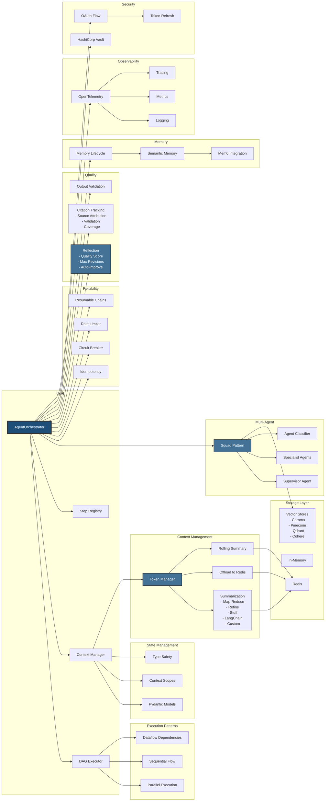
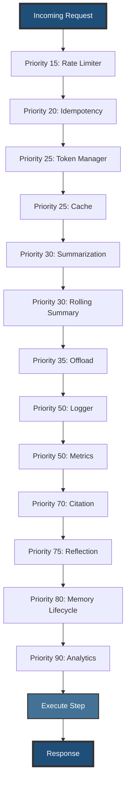
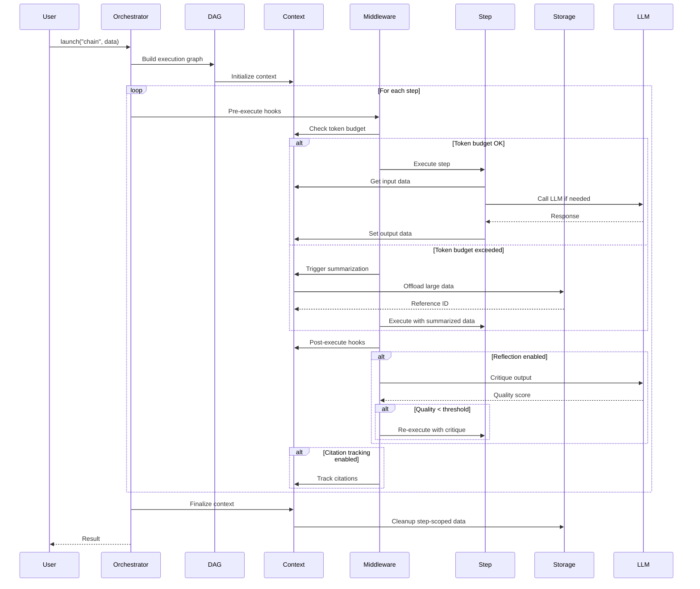
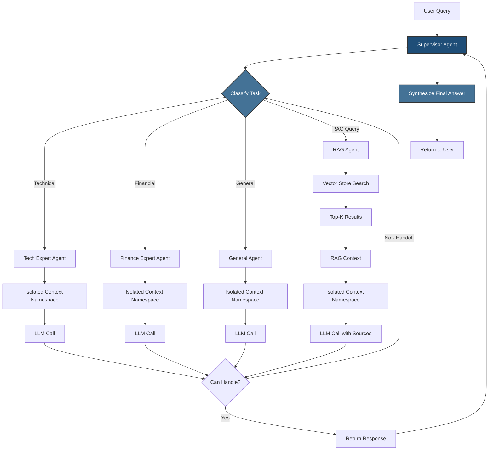
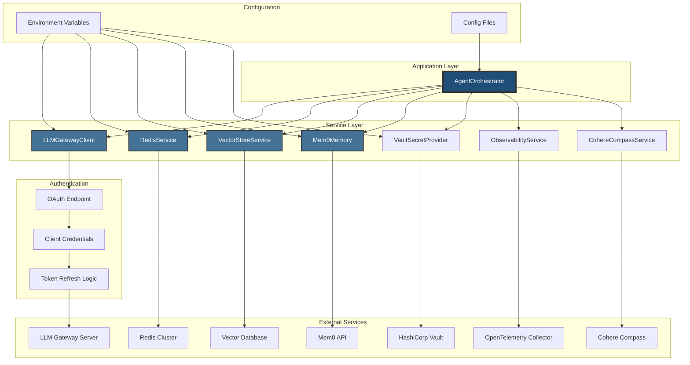

# AgentOrchestrator - Comprehensive Architecture Diagram

## Main Architecture Decision Tree

```mermaid
graph TD
    Start[AgentOrchestrator] --> ExecutionModel{Execution Model?}

    ExecutionModel -->|DAG-Based| DAG[DAG Execution Engine]
    ExecutionModel -->|Sequential| Sequential[Sequential Execution]

    DAG --> DepResolution{Dependency Resolution?}
    DepResolution -->|Explicit| ExplicitDeps["deps=['step1', 'step2']"]
    DepResolution -->|Dataflow| DataflowDeps["@produces / @consumes"]

    ExplicitDeps --> StateManagement
    DataflowDeps --> StateManagement
    Sequential --> StateManagement

    StateManagement{State Management?} -->|Type-Safe| Pydantic[Pydantic Models]
    StateManagement -->|Basic| BasicState[ctx.get/set]

    Pydantic --> ContextScope
    BasicState --> ContextScope

    ContextScope{Context Scope?} -->|STEP| StepScope[Step-scoped cleanup]
    ContextScope -->|CHAIN| ChainScope[Chain-wide sharing]
    ContextScope -->|GLOBAL| GlobalScope[Application constants]

    StepScope --> ContextSize
    ChainScope --> ContextSize
    GlobalScope --> ContextSize

    ContextSize{Context Size Management?} -->|Token Tracking| TokenMgr[TokenManagerMiddleware]
    ContextSize -->|Summarization| Summarization[SummarizerMiddleware]
    ContextSize -->|Offloading| Offload[OffloadMiddleware]
    ContextSize -->|Rolling Summary| Rolling[RollingSummaryMiddleware]

    Summarization --> SummarizationStrategy{Summarization Strategy?}
    SummarizationStrategy -->|Map-Reduce| MapReduce[Split, summarize chunks, merge]
    SummarizationStrategy -->|Refine| Refine[Iterative refinement]
    SummarizationStrategy -->|Stuff| Stuff[Single prompt with all context]
    SummarizationStrategy -->|LangChain| LangChain[LangChain integration]
    SummarizationStrategy -->|Custom LLM| CustomLLM[Custom summarizer]

    MapReduce --> StorageBackend
    Refine --> StorageBackend
    Stuff --> StorageBackend
    LangChain --> StorageBackend
    CustomLLM --> StorageBackend

    Offload --> StorageBackend{Storage Backend?}
    Rolling --> StorageBackend
    TokenMgr --> StorageBackend

    StorageBackend -->|Redis| Redis[RedisContextStore]
    StorageBackend -->|In-Memory| InMemory[InMemoryStore]
    StorageBackend -->|S3| S3[S3Store - future]

    Redis --> AgentType
    InMemory --> AgentType
    S3 --> AgentType

    AgentType{Agent Architecture?} -->|Single Agent| SingleAgent[Single LLM Agent]
    AgentType -->|Multi-Agent| MultiAgent[Squad Pattern]
    AgentType -->|RAG Agent| RAGAgent[RAG Agent]

    MultiAgent --> SquadPattern{Squad Pattern?}
    SquadPattern -->|Supervisor| Supervisor[Supervisor + Specialists]
    SquadPattern -->|MultiOrchestrator| MultiOrch[MultiAgentOrchestrator]

    Supervisor --> Classifier
    MultiOrch --> Classifier{Agent Classifier?}

    Classifier -->|LLM-Based| LLMClassifier[LLMGatewayClassifier]
    Classifier -->|Embedding| EmbeddingClassifier[EmbeddingClassifier]
    Classifier -->|Keyword| KeywordClassifier[KeywordClassifier]
    Classifier -->|Custom| CustomClassifier[Custom Classifier]

    LLMClassifier --> Isolation
    EmbeddingClassifier --> Isolation
    KeywordClassifier --> Isolation
    CustomClassifier --> Isolation

    RAGAgent --> VectorStore{Vector Store?}
    VectorStore -->|Chroma| Chroma[ChromaDB]
    VectorStore -->|Pinecone| Pinecone[Pinecone]
    VectorStore -->|Qdrant| Qdrant[Qdrant]
    VectorStore -->|Cohere Compass| CohereCompass[Cohere Compass]

    Chroma --> Isolation
    Pinecone --> Isolation
    Qdrant --> Isolation
    CohereCompass --> Isolation

    SingleAgent --> Isolation

    Isolation{Context Isolation?} -->|None| NoIsolation[Shared context]
    Isolation -->|Partial| PartialIsolation[Own writes + coordinator reads]
    Isolation -->|Full| FullIsolation[Complete namespace isolation]

    NoIsolation --> Middleware
    PartialIsolation --> Middleware
    FullIsolation --> Middleware

    Middleware{Middleware Stack?} --> Reliability
    Middleware --> Quality
    Middleware --> Memory
    Middleware --> Observability

    Reliability{Reliability Features?} -->|Idempotency| Idempotency[IdempotencyMiddleware]
    Reliability -->|Rate Limiting| RateLimit[RateLimiterMiddleware]
    Reliability -->|Circuit Breaker| CircuitBreaker[CircuitBreaker Pattern]
    Reliability -->|Retry Logic| RetryLogic[Exponential backoff]
    Reliability -->|Resumable| Resumable[Resumable Chains]

    Idempotency --> IdempotencyStore{Idempotency Store?}
    IdempotencyStore -->|Redis| IdempotencyRedis[Redis-backed]
    IdempotencyStore -->|In-Memory| IdempotencyMem[In-memory cache]

    IdempotencyRedis --> QualityAssurance
    IdempotencyMem --> QualityAssurance
    RateLimit --> QualityAssurance
    CircuitBreaker --> QualityAssurance
    RetryLogic --> QualityAssurance
    Resumable --> QualityAssurance

    Quality{Quality Assurance?} -->|Reflection| Reflection[ReflectionMiddleware]
    Quality -->|Citation| Citation[CitationMiddleware]
    Quality -->|Validation| Validation[Output validation]

    Reflection --> ReflectionConfig{Reflection Config?}
    ReflectionConfig -->|Quality Threshold| QualityThreshold[0.0 - 1.0 score]
    ReflectionConfig -->|Max Revisions| MaxRevisions[1-5 attempts]
    ReflectionConfig -->|Custom Critique| CustomCritique[Custom prompt]

    QualityThreshold --> CitationConfig
    MaxRevisions --> CitationConfig
    CustomCritique --> CitationConfig

    Citation --> CitationConfig{Citation Config?}
    CitationConfig -->|Require Citations| RequireCitations[Enforce source attribution]
    CitationConfig -->|Validate Sources| ValidateSources[Check against source content]
    CitationConfig -->|Min Coverage| MinCoverage[80% coverage threshold]

    RequireCitations --> MemoryManagement
    ValidateSources --> MemoryManagement
    MinCoverage --> MemoryManagement
    Validation --> MemoryManagement

    Memory{Memory Management?} -->|Lifecycle| Lifecycle[MemoryLifecycleMiddleware]
    Memory -->|Semantic Memory| SemanticMem[Mem0 Integration]

    Lifecycle --> LifecycleConfig{Lifecycle Config?}
    LifecycleConfig -->|Importance Eval| ImportanceEval[LLM-based scoring]
    LifecycleConfig -->|Auto-promote| AutoPromote[Pattern detection]
    LifecycleConfig -->|Threshold| PromoteThreshold[0.7 importance]

    ImportanceEval --> MemoryBackend
    AutoPromote --> MemoryBackend
    PromoteThreshold --> MemoryBackend

    SemanticMem --> MemoryBackend{Memory Backend?}
    MemoryBackend -->|Mem0| Mem0[Mem0 Service]
    MemoryBackend -->|Redis| MemoryRedis[Redis storage]
    MemoryBackend -->|Custom| CustomMemory[Custom provider]

    Mem0 --> ObservabilityConfig
    MemoryRedis --> ObservabilityConfig
    CustomMemory --> ObservabilityConfig

    Observability{Observability?} -->|Logging| Logging[LoggerMiddleware]
    Observability -->|Metrics| Metrics[MetricsMiddleware]
    Observability -->|Tracing| Tracing[OpenTelemetry]
    Observability -->|Analytics| Analytics[AnalyticsMiddleware]

    Logging --> LogConfig
    Metrics --> MetricsConfig
    Tracing --> TracingConfig
    Analytics --> AnalyticsConfig

    LogConfig{Logging Config?} -->|Level| LogLevel[DEBUG/INFO/WARN/ERROR]
    LogConfig -->|Format| LogFormat[JSON/Text]
    LogConfig -->|Destination| LogDest[Console/File/Remote]

    LogLevel --> Security
    LogFormat --> Security
    LogDest --> Security

    MetricsConfig{Metrics Config?} -->|Token Count| TokenMetrics[Track token usage]
    MetricsConfig -->|Latency| LatencyMetrics[Step execution time]
    MetricsConfig -->|Error Rate| ErrorMetrics[Failure tracking]

    TokenMetrics --> Security
    LatencyMetrics --> Security
    ErrorMetrics --> Security

    TracingConfig{Tracing Config?} -->|Provider| TracingProvider[Jaeger/Datadog/NewRelic]
    TracingConfig -->|Sampling| Sampling[100%/10%/1%]
    TracingConfig -->|Context Propagation| ContextProp[W3C Trace Context]

    TracingProvider --> Security
    Sampling --> Security
    ContextProp --> Security

    AnalyticsConfig{Analytics Config?} -->|Usage Tracking| UsageTracking[User behavior]
    AnalyticsConfig -->|Performance| PerfAnalytics[Performance trends]

    UsageTracking --> Security
    PerfAnalytics --> Security

    ObservabilityConfig{Observability Config?} -->|OpenTelemetry| OTel[Full OTEL integration]
    ObservabilityConfig -->|Custom| CustomObs[Custom observability]

    OTel --> Security
    CustomObs --> Security

    Security{Security & Auth?} -->|Secrets| Secrets[VaultSecretProvider]
    Security -->|LLM Auth| LLMAuth[OAuth/API Key]

    Secrets --> SecretProvider{Secret Provider?}
    SecretProvider -->|Vault| Vault[HashiCorp Vault]
    SecretProvider -->|Env Vars| EnvVars[Environment variables]
    SecretProvider -->|AWS Secrets| AWSSecrets[AWS Secrets Manager]

    Vault --> LLMAuthConfig
    EnvVars --> LLMAuthConfig
    AWSSecrets --> LLMAuthConfig

    LLMAuth --> LLMAuthConfig{LLM Auth Config?}
    LLMAuthConfig -->|OAuth| OAuth[Client credentials flow]
    LLMAuthConfig -->|API Key| APIKey[Static API key]
    LLMAuthConfig -->|Token Refresh| TokenRefresh[Auto-refresh tokens]

    OAuth --> Connectors
    APIKey --> Connectors
    TokenRefresh --> Connectors

    Connectors{External Connectors?} -->|MCP| MCP[Model Context Protocol]
    Connectors -->|Custom| CustomConnector[Custom integrations]

    MCP --> MCPTransport{MCP Transport?}
    MCPTransport -->|HTTP| HTTPTransport[HTTP transport]
    MCPTransport -->|STDIO| STDIOTransport[STDIO transport]
    MCPTransport -->|SSE| SSETransport[Server-sent events]

    HTTPTransport --> Deployment
    STDIOTransport --> Deployment
    SSETransport --> Deployment
    CustomConnector --> Deployment

    Deployment{Deployment Mode?} -->|Development| DevMode[Hot reload, verbose logs]
    Deployment -->|Production| ProdMode[Optimized, minimal logs]

    DevMode --> CLI
    ProdMode --> CLI

    CLI{CLI Tools?} -->|Run| CLIRun[ao run chain]
    CLI -->|Debug| CLIDebug[ao debug --verbose]
    CLI -->|Validate| CLIValidate[ao check]
    CLI -->|Visualize| CLIVisualize[ao graph]
    CLI -->|Health| CLIHealth[ao health]
    CLI -->|Doctor| CLIDoctor[ao doctor]
    CLI -->|Scaffold| CLIScaffold[ao new agent/chain/step]

    CLIRun --> End[Complete Pipeline]
    CLIDebug --> End
    CLIValidate --> End
    CLIVisualize --> End
    CLIHealth --> End
    CLIDoctor --> End
    CLIScaffold --> End

    style Start fill:#1f4e78,stroke:#333,stroke-width:4px,color:#fff
    style End fill:#1f4e78,stroke:#333,stroke-width:4px,color:#fff
    style DAG fill:#447296,stroke:#333,stroke-width:2px,color:#fff
    style MultiAgent fill:#447296,stroke:#333,stroke-width:2px,color:#fff
    style Reflection fill:#447296,stroke:#333,stroke-width:2px,color:#fff
    style Summarization fill:#447296,stroke:#333,stroke-width:2px,color:#fff
```

## Simplified Component Overview

## Middleware Priority Flow

## Data Flow Architecture

## Squad Multi-Agent Architecture

## Service Integration Architecture

## Environment Configuration Decision Tree

```mermaid
graph TD
    Start[Application Start] --> LoadConfig{Load Configuration}

    LoadConfig -->|Environment Variables| EnvVars[Parse ENV Vars]
    LoadConfig -->|Config File| ConfigFile[Parse YAML/JSON]

    EnvVars --> LLMConfig{LLM Configuration?}
    ConfigFile --> LLMConfig

    LLMConfig -->|Gateway URL Set| LLMGateway[LLMGatewayClient]
    LLMConfig -->|API Key Set| DirectLLM[Direct LLM API]

    LLMGateway --> AuthMethod{Auth Method?}
    AuthMethod -->|OAuth| OAuthFlow[OAuth2 Client Credentials]
    AuthMethod -->|API Key| APIKeyAuth[API Key Header]

    OAuthFlow --> TokenCache{Token Cached?}
    TokenCache -->|Yes + Valid| UseCached[Use Cached Token]
    TokenCache -->|No or Expired| FetchNew[Fetch New Token]

    FetchNew --> StoreToken[Store in Cache]
    StoreToken --> LLMReady
    UseCached --> LLMReady[LLM Service Ready]
    APIKeyAuth --> LLMReady
    DirectLLM --> LLMReady

    LLMReady --> ContextStore{Context Store?}

    ContextStore -->|Redis Config| RedisStore[RedisContextStore]
    ContextStore -->|No Redis| InMemStore[InMemoryStore]

    RedisStore --> RedisConfig{Redis Configuration}
    RedisConfig --> Host[REDIS_HOST]
    RedisConfig --> Port[REDIS_PORT]
    RedisConfig --> Password[REDIS_PASSWORD]
    RedisConfig --> SSL[SSL Enabled?]

    Host --> RedisClient[Redis Client]
    Port --> RedisClient
    Password --> RedisClient
    SSL --> RedisClient

    RedisClient --> VectorConfig
    InMemStore --> VectorConfig

    VectorConfig{Vector Store?} -->|Chroma| ChromaConfig[Chroma Configuration]
    VectorConfig -->|Pinecone| PineconeConfig[Pinecone Configuration]
    VectorConfig -->|Qdrant| QdrantConfig[Qdrant Configuration]
    VectorConfig -->|None| NoVector[No Vector Store]

    ChromaConfig --> ChromaClient[Chroma Client]
    PineconeConfig --> PineconeClient[Pinecone Client]
    QdrantConfig --> QdrantClient[Qdrant Client]

    ChromaClient --> MemoryConfig
    PineconeClient --> MemoryConfig
    QdrantClient --> MemoryConfig
    NoVector --> MemoryConfig

    MemoryConfig{Memory Service?} -->|Mem0| Mem0Config[Mem0 Configuration]
    MemoryConfig -->|None| NoMemory[No Long-term Memory]

    Mem0Config --> Mem0APIKey[MEM0_API_KEY]
    Mem0APIKey --> Mem0Client[Mem0 Client]

    Mem0Client --> SecretConfig
    NoMemory --> SecretConfig

    SecretConfig{Secret Management?} -->|Vault| VaultConfig[Vault Configuration]
    SecretConfig -->|Env Only| EnvSecrets[Environment Secrets]

    VaultConfig --> VaultURL[VAULT_ADDR]
    VaultConfig --> VaultToken[VAULT_TOKEN]
    VaultConfig --> VaultPath[VAULT_PATH]

    VaultURL --> VaultClient[Vault Client]
    VaultToken --> VaultClient
    VaultPath --> VaultClient

    VaultClient --> ObsConfig
    EnvSecrets --> ObsConfig

    ObsConfig{Observability?} -->|OpenTelemetry| OTelConfig[OTEL Configuration]
    ObsConfig -->|Custom| CustomObs[Custom Observability]
    ObsConfig -->|None| NoObs[No Observability]

    OTelConfig --> OTelEndpoint[OTEL_EXPORTER_OTLP_ENDPOINT]
    OTelConfig --> ServiceName[SERVICE_NAME]
    OTelConfig --> Sampling[SAMPLING_RATE]

    OTelEndpoint --> OTelClient[OpenTelemetry SDK]
    ServiceName --> OTelClient
    Sampling --> OTelClient

    OTelClient --> AppReady
    CustomObs --> AppReady
    NoObs --> AppReady[Application Ready]

    style Start fill:#1f4e78,stroke:#333,stroke-width:4px,color:#fff
    style AppReady fill:#1f4e78,stroke:#333,stroke-width:4px,color:#fff
    style LLMGateway fill:#447296,stroke:#333,stroke-width:2px,color:#fff
    style RedisStore fill:#447296,stroke:#333,stroke-width:2px,color:#fff
```

