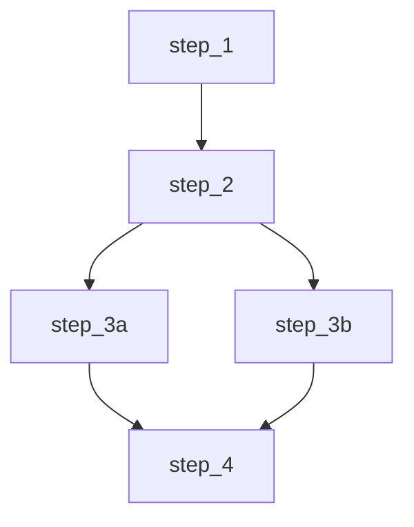

# Validation & Inspection Commands

Commands for validating chain definitions and inspecting registered components.

## check

Quick validation of chain definitions. Checks for basic validity.

```bash
ao check [chain_name]
```

### Arguments

| Argument | Description |
|----------|-------------|
| `chain_name` | Optional. Specific chain to check. If omitted, checks all chains. |

### Examples

```bash
# Check all registered chains
ao check

# Check a specific chain
ao check my_chain
```

### What It Checks

- Chain exists in registry
- All steps referenced in chain exist
- No circular dependencies
- Step handlers are registered

---

## validate

Comprehensive validation with detailed checks and optional dry-run.

```bash
ao validate <chain_name> [options]
```

### Options

| Option | Short | Description |
|--------|-------|-------------|
| `--execute` | `-e` | Actually execute validation (not just dry-run) |
| `--check-agents` | | Check agent availability (default: true) |
| `--check-resources` | | Check resource registration (default: true) |
| `--data` | `-d` | Sample JSON input data for contract validation |
| `--json` | `-j` | Output as JSON |

### Examples

```bash
# Comprehensive validation
ao validate my_chain

# Validate with sample data
ao validate my_chain --data '{"name": "test", "value": 42}'

# Get JSON output
ao validate my_chain --json
```

### What It Validates

1. **Chain existence** - Chain is registered
2. **Step existence** - All steps in the chain exist
3. **DAG validity** - No circular dependencies, valid execution groups
4. **Dependency references** - All dependencies reference valid steps in the chain
5. **Input/output contracts** - Pydantic models are valid
6. **Agent availability** - Registered agents can be instantiated
7. **Resource registration** - Required resources are registered
8. **Sample data validation** - If provided, validates against input models

### Output

```
════════════════════════════════════════════════════════════════
  Validating: my_chain
  Mode: Dry Run
════════════════════════════════════════════════════════════════

  ✓ Chain exists: my_chain
  ✓ All 5 steps found
  ✓ DAG valid (3 execution groups)
  ✓ All dependencies valid
  ✓ Input/output contracts valid
  ✓ 2 agents registered
  ✓ 3 resources registered

  ──────────────────────────────────────────────────────

  Checks: 7/7 passed
  Status: VALID

════════════════════════════════════════════════════════════════
```

---

## list

List all registered definitions (chains, steps, agents).

```bash
ao list
```

### Examples

```bash
ao list
```

### Output

Shows all registered:
- **Chains** - Name, steps count, metadata
- **Steps** - Name, dependencies, produces
- **Agents** - Name, type, status

---

## graph

Show DAG visualization of a chain.

```bash
ao graph <chain_name> [options]
```

### Options

| Option | Short | Description |
|--------|-------|-------------|
| `--format` | `-f` | Output format: `ascii` (default) or `mermaid` |

### Examples

**ASCII output:**

```bash
ao graph my_chain
```

```
my_chain DAG:
═══════════════════════════════════════

    ┌─────────────┐
    │   step_1    │
    └──────┬──────┘
           │
    ┌──────┴──────┐
    │   step_2    │
    └──────┬──────┘
           │
     ┌─────┴─────┐
     │           │
┌────┴────┐ ┌────┴────┐
│ step_3a │ │ step_3b │
└────┬────┘ └────┬────┘
     │           │
     └─────┬─────┘
           │
    ┌──────┴──────┐
    │   step_4    │
    └─────────────┘
```

**Mermaid output (for documentation):**

```bash
ao graph my_chain --format mermaid
```



### Use Cases

- **Understanding flow** - Visualize how data moves through your chain
- **Documentation** - Export Mermaid diagrams for docs
- **Debugging** - Identify unexpected dependencies
- **Optimization** - Find parallelization opportunities
