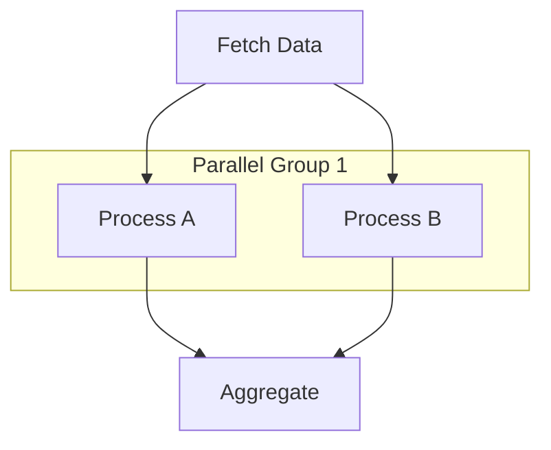

# AgentOrchestrator Features

A comprehensive DAG-based chain orchestration framework for AI/ML pipelines.

```
    ___    ____
   /   |  / __ \
  / /| | / / / /
 / ___ |/ /_/ /
/_/  |_|\____/

Your Agentic AI Workflow
```

---

## Feature Summary

| Feature | What It Does |
|---------|--------------|
| **Core Orchestration** | Executes DAG-based workflows with automatic dependency resolution and parallel execution |
| **Step & Chain Decorators** | Declaratively define steps and chains with dependencies, timeouts, and retries |
| **Data Agents** | Standardized interface for external data sources (APIs, databases, MCP servers) |
| **Context Management** | Shared state between steps with scoping, token tracking, and automatic cleanup |
| **Middleware System** | Pluggable pipeline for cross-cutting concerns (logging, caching, rate limiting) |
| **Citation Tracking** | Track sources for AI-generated content for verification and transparency |
| **LLM Integration** | LCEL chain builders with OpenAI/Anthropic provider flexibility |
| **Resumable Execution** | Checkpoint chain progress to resume after failures |
| **CLI Tools** | Command-line interface for running, validating, and managing chains |
| **Testing & Mocking** | Isolated testing with mock agents and test context utilities |
| **Observability** | Structured logging, OpenTelemetry tracing, and Prometheus metrics |
| **MCP Integration** | Connect to Model Context Protocol servers for external tools |
| **Resource Management** | Dependency injection with lazy initialization and lifecycle management |
| **Versioning & Migrations** | Semantic versioning for chains with output schema migrations |
| **Context Serializers** | Safe serialization with truncation, redaction, and summaries |
| **Plugin Discovery** | Auto-discover agents and middleware via Python entry points |
| **Capability Schema** | Self-documenting agents with parameter validation and API doc generation |
| **DAG Visualization** | Generate ASCII and Mermaid diagrams of chain execution graphs |
| **Health Checks** | Comprehensive health checks with Kubernetes-ready probes |
| **Utility Decorators** | Timing, retry, and circuit breaker decorators for resilient code |
| **Contract Validation** | Pydantic-based input/output validation with clear error messages |

---

## Table of Contents

1. [Core Orchestration](#1-core-orchestration)
2. [Step & Chain Decorators](#2-step--chain-decorators)
3. [Data Agents](#3-data-agents)
4. [Context Management](#4-context-management)
5. [Middleware System](#5-middleware-system)
6. [Citation & Provenance Tracking](#6-citation--provenance-tracking)
7. [LLM Integration](#7-llm-integration)
8. [Resumable Execution](#8-resumable-execution)
9. [CLI Tools](#9-cli-tools)
10. [Testing & Mocking](#10-testing--mocking)
11. [Observability](#11-observability)
12. [MCP Server Integration](#12-mcp-server-integration)
13. [Resource Management](#13-resource-management)
14. [Versioning & Migrations](#14-versioning--migrations)
15. [Context Serializers](#15-context-serializers)
16. [Plugin Discovery](#16-plugin-discovery)
17. [Agent Capability Schema](#17-agent-capability-schema)
18. [DAG Visualization](#18-dag-visualization)
19. [Health Check System](#19-health-check-system)
20. [Utility Decorators](#20-utility-decorators)
21. [Contract Validation](#21-contract-validation)

---

## 1. Core Orchestration

**What it does:** Manages DAG-based execution of steps with automatic dependency resolution, parallel execution, and fail-fast or continue-on-error modes.

### Basic Usage

```python
from agentorchestrator import AgentOrchestrator, ChainContext

ao = AgentOrchestrator(name="my_app")

@ao.step
async def fetch_data(ctx: ChainContext):
    return {"data": "fetched"}

@ao.step(deps=["fetch_data"])
async def process_data(ctx: ChainContext):
    data = ctx.get("data")
    return {"processed": True}

@ao.chain
class MyChain:
    steps = ["fetch_data", "process_data"]

# Run
result = await ao.launch("MyChain", {"input": "value"})
```

### Edge Cases & Options

```python
# Isolated instance (no registry bleed between tests)
ao = AgentOrchestrator(name="test", isolated=True)

# Continue on error (partial success)
result = await ao.launch("MyChain", {}, continue_on_error=True)

# With timeout
result = await ao.launch("MyChain", {}, timeout_ms=30000)

# Parallel step execution (steps without deps run concurrently)
@ao.step  # No deps - runs in parallel with other dep-free steps
async def step_a(ctx): ...

@ao.step  # No deps - runs in parallel with step_a
async def step_b(ctx): ...

@ao.step(deps=["step_a", "step_b"])  # Waits for both
async def step_c(ctx): ...
```

---

## 2. Step & Chain Decorators

**What it does:** Declarative definition of steps and chains with dependency tracking.

### Step Options

```python
@ao.step(
    name="my_step",           # Custom name (default: function name)
    deps=["other_step"],      # Dependencies (runs after these)
    produces=["output_key"],  # Keys this step produces
    timeout_ms=5000,          # Step-specific timeout
    retries=3,                # Auto-retry on failure
    retry_delay_ms=1000,      # Delay between retries
)
async def my_step(ctx: ChainContext):
    # Access input
    value = ctx.get("input_key", default="fallback")

    # Store output
    ctx.set("output_key", result)

    return {"status": "done"}  # Returned to chain result
```

### Chain Options

```python
@ao.chain(
    name="MyChain",
    version="1.0.0",
    description="Does something useful",
)
class MyChain:
    steps = ["step1", "step2", "step3"]

    # Optional: Dynamic step list
    @classmethod
    def get_steps(cls, ctx):
        if ctx.get("fast_mode"):
            return ["step1", "step3"]  # Skip step2
        return cls.steps
```

### Conditional Steps

```python
@ao.step(deps=["check_condition"])
async def optional_step(ctx: ChainContext):
    if not ctx.get("should_run"):
        return None  # Step output is None, chain continues
    return {"data": "processed"}
```

---

## 3. Data Agents

**What it does:** Standardized interface for external data sources (APIs, databases, MCP servers).

### Creating Agents

```python
from agentorchestrator.agents import AgentResult, BaseAgent

@ao.agent(
    name="news_agent",
    version="1.0",
    capabilities=["search", "sentiment"],
)
class NewsAgent(BaseAgent):
    async def fetch(self, query: str, **kwargs) -> AgentResult:
        # Your data fetching logic
        data = await self._call_news_api(query)

        return AgentResult(
            data=data,
            source="news_agent",
            query=query,
            duration_ms=150.5,
        )
```

### Using Agents in Steps

```python
@ao.step
async def get_news(ctx: ChainContext):
    agent = ao.get_agent("news_agent")
    result = await agent.fetch("Apple earnings", days=30)

    if result.success:
        ctx.set("news_data", result.data)
    else:
        ctx.set("news_error", result.error)

    return {"fetched": result.success}
```

### Agent with Citations

```python
@ao.agent(name="sec_agent")
class SECAgent(BaseAgent):
    async def fetch(self, query: str, **kwargs) -> AgentResult:
        data = await self._fetch_filing(query)

        result = AgentResult(
            data=data,
            source="sec_agent",
            query=query,
            raw_content=data.get("raw_text"),  # For citation verification
        )

        # Add citation
        result.add_citation(
            content="Revenue was $394.3 billion for FY2024",
            document_id="AAPL-10K-2024",
            reasoning="Direct revenue figure from filing",
        )

        return result
```

---

## 4. Context Management

**What it does:** Shared state between steps with scoping, token tracking, and automatic cleanup.

### Scopes

```python
from agentorchestrator.core.context import ContextScope

@ao.step
async def my_step(ctx: ChainContext):
    # CHAIN scope (default) - available to all steps
    ctx.set("shared_data", value, scope=ContextScope.CHAIN)

    # STEP scope - cleared after step completes
    ctx.set("temp_data", value, scope=ContextScope.STEP)

    # GLOBAL scope - persists across chain runs
    ctx.set("cache", value, scope=ContextScope.GLOBAL)
```

### Token Tracking

```python
# Track token usage for LLM context management
ctx.set("llm_response", response, token_count=1500)

# Check total tokens
print(f"Total tokens: {ctx.total_tokens}")
print(f"Max allowed: {ctx.max_tokens}")
```

### Accessing Results

```python
# Get all step results
for result in ctx.results:
    print(f"{result.step_name}: {result.duration_ms}ms")

# Get last result
last = ctx.last_result
if last.failed:
    print(f"Error: {last.error}")
```

---

## 5. Middleware System

**What it does:** Pluggable processing pipeline for cross-cutting concerns.

### Available Middleware

| Middleware | Purpose | Usage |
|------------|---------|-------|
| `LoggerMiddleware` | Structured logging | `ao.use(LoggerMiddleware())` |
| `CacheMiddleware` | Response caching | `ao.use(CacheMiddleware(ttl=300))` |
| `TokenManagerMiddleware` | Token budget tracking | `ao.use(TokenManagerMiddleware(max=100000))` |
| `SummarizerMiddleware` | Auto-summarize large contexts | `ao.use(SummarizerMiddleware(...))` |
| `CitationMiddleware` | Citation tracking & validation | `ao.use(CitationMiddleware())` |
| `MetricsMiddleware` | Prometheus/OTel metrics | `ao.use(MetricsMiddleware())` |
| `RateLimiterMiddleware` | Rate limiting | `ao.use(RateLimiterMiddleware(rpm=60))` |
| `CircuitBreakerMiddleware` | Fail-fast on errors | `ao.use(CircuitBreakerMiddleware())` |
| `IdempotencyMiddleware` | Prevent duplicate runs | `ao.use(IdempotencyMiddleware())` |
| `OffloadMiddleware` | Offload large data to Redis | `ao.use(OffloadMiddleware())` |
| `UsageAnalyticsMiddleware` | Track usage & costs | `ao.use(UsageAnalyticsMiddleware())` |

### Middleware Example

```python
from agentorchestrator import (
    LoggerMiddleware,
    CacheMiddleware,
    CitationMiddleware,
)

ao = AgentOrchestrator(name="my_app")

# Add middleware (order matters - first added runs first)
ao.use(LoggerMiddleware(level="INFO"))
ao.use(CacheMiddleware(ttl_seconds=300))
ao.use(CitationMiddleware(
    require_citations=True,
    min_coverage=0.8,
))
```

### Custom Middleware

```python
from agentorchestrator.middleware import Middleware

class MyMiddleware(Middleware):
    @property
    def name(self) -> str:
        return "my_middleware"

    async def before_step(self, ctx, step_name):
        print(f"Starting: {step_name}")

    async def after_step(self, ctx, result):
        print(f"Finished: {result.step_name} in {result.duration_ms}ms")
        return result  # Can modify result

    async def on_error(self, ctx, step_name, error):
        print(f"Error in {step_name}: {error}")
        # Return True to suppress error, False to propagate
        return False
```

---

## 6. Citation & Provenance Tracking

**What it does:** Track sources for AI-generated content, enabling verification and transparency.

### Basic Citation

```python
from agentorchestrator import Citation, CitedValue, cite

# Full citation
citation = Citation(
    source_type="agent",
    source_name="sec_agent",
    content="Total revenue was $394.3 billion",
    reasoning="Direct figure from 10-K filing",
    document_id="AAPL-10K-2024",
)

# Value with citation
revenue = CitedValue(
    value=394.3,
    unit="billion USD",
    citations=[citation],
)

# Quick helper
margin = cite(
    value=25.3,
    source_name="earnings_agent",
    content="EBITDA margin was 25.3%",
)
```

### Context-Level Citations

```python
@ao.step
async def extract_metrics(ctx: ChainContext):
    # Add source content for verification
    ctx.add_source_content("sec_agent", raw_filing_text)

    # Add citation
    ctx.add_citation(
        content="Revenue grew 8% YoY",
        source_name="sec_agent",
        reasoning="From management discussion section",
    )

    # Get all citations
    citations = ctx.get_citations()

    # Verify citations against sources
    verification = ctx.verify_citations()

    # Get summary
    summary = ctx.get_citation_summary()
    # {"total": 5, "verified": 4, "by_source": {"sec_agent": 3, "news_agent": 2}}
```

### Citation Middleware

```python
ao.use(CitationMiddleware(
    require_citations=True,      # Enforce citation requirements
    validate_against_sources=True,  # Verify against source content
    min_coverage=0.8,            # 80% of values must have citations
    fail_on_missing=False,       # Warn but don't fail
))
```

---

## 7. LLM Integration

**What it does:** LCEL (LangChain Expression Language) chain builders with provider flexibility.

### Setup

```bash
pip install agentorchestrator[llm]  # Includes langchain-openai, langchain-anthropic
```

### Extraction Chains

```python
from agentorchestrator.llm import create_extraction_chain
from pydantic import BaseModel

class CompanyInfo(BaseModel):
    name: str
    revenue: float
    employees: int

# Create extraction chain
chain = create_extraction_chain(
    output_schema=CompanyInfo,
    model="gpt-4o",
    temperature=0,
)

# Use in step
@ao.step
async def extract_info(ctx: ChainContext):
    text = ctx.get("document_text")
    result = await chain.ainvoke({"text": text})
    return {"company_info": result}
```

### Text Generation

```python
from agentorchestrator.llm import create_text_chain

chain = create_text_chain(
    system_prompt="You are a financial analyst.",
    model="claude-3-5-sonnet",
)

response = await chain.ainvoke({
    "input": "Summarize Apple's Q4 earnings"
})
```

### Provider Selection

```python
from agentorchestrator.llm import get_openai_llm, get_anthropic_llm

# OpenAI
llm = get_openai_llm(model="gpt-4o", temperature=0.7)

# Anthropic
llm = get_anthropic_llm(model="claude-3-5-sonnet")

# Custom gateway
from agentorchestrator.llm import set_default_llm
set_default_llm(my_custom_llm)
```

---

## 8. Resumable Execution

**What it does:** Checkpoint chain progress for recovery after failures.

### Enable Resumable Runs

```python
# Launch with checkpointing
result = await ao.launch_resumable("MyChain", {"input": "data"})

run_id = result["run_id"]
print(f"Run ID: {run_id}")
print(f"Status: {result['status']}")  # "completed" or "failed"
```

### Resume Failed Runs

```python
# Resume from last successful step
result = await ao.resume(run_id)

# Resume from specific step
result = await ao.resume(run_id, from_step="step_3")
```

### List & Inspect Runs

```python
# List recent runs
runs = await ao.list_runs(limit=10)
for run in runs:
    print(f"{run.run_id}: {run.chain_name} ({run.status})")

# Get run details
run_info = await ao.get_run(run_id)
print(f"Steps completed: {run_info.completed_steps}")
print(f"Last error: {run_info.error}")
```

### CLI Commands

```bash
# List runs
ao runs --limit 10

# Resume a run
ao resume abc123

# Get run details
ao run-info abc123

# Get partial outputs
ao run-output abc123 --step step_2
```

---

## 9. CLI Tools

**What it does:** Command-line interface for running and managing chains.

### Available Commands

```bash
# Show banner and help
ao

# Run a chain
ao run MyChain --input '{"company": "Apple"}'
ao run MyChain --file input.json

# Validate chain definitions
ao check MyChain
ao validate  # All chains

# List registered items
ao list chains
ao list steps
ao list agents

# Visualize DAG
ao graph MyChain

# Health check
ao health

# Diagnostics
ao doctor

# Version info
ao version

# Debug mode
ao debug MyChain --input '{}'

# Create new project
ao new my_project
```

### Configuration

```bash
# Set definitions path
ao --definitions ./my_chains run MyChain

# Environment variables
export AO_DEBUG=1
export AO_ENV=production
export LLM_API_KEY=your-key
```

---

## 10. Testing & Mocking

**What it does:** Test utilities for isolated, reproducible chain testing.

### Isolated Testing

```python
from agentorchestrator.testing import IsolatedOrchestrator, MockAgent

# Isolated instance (no global registry pollution)
ao = IsolatedOrchestrator(name="test")

# Define steps and chains as normal
@ao.step
async def my_step(ctx):
    return {"result": "test"}
```

### Mock Agents

```python
# Create mock agent
mock_news = MockAgent(
    name="news_agent",
    response={"articles": [{"title": "Test"}]},
)

# Register mock
ao.register_agent("news_agent", mock_news)

# Or with dynamic responses
mock_news = MockAgent(
    name="news_agent",
    response_fn=lambda query, **kw: {"query": query, "count": 5}
)
```

### Test Context

```python
from agentorchestrator.testing import create_test_context

# Create context with preset data
ctx = create_test_context(
    initial_data={
        "company": "Apple",
        "ticker": "AAPL",
    }
)

# Run individual step
result = await my_step(ctx)
assert result["status"] == "done"
```

### Assertions

```python
from agentorchestrator.testing import assert_step_completed, assert_chain_valid

# Validate chain structure
assert_chain_valid(ao, "MyChain")

# Check step completed
result = await ao.launch("MyChain", {})
assert_step_completed(result, "my_step")
```

---

## 11. Observability

**What it does:** Logging, tracing, and metrics for production monitoring.

### Structured Logging

```python
from agentorchestrator import configure_logging, get_logger

# Configure logging
configure_logging(
    level="INFO",
    format="json",  # or "text"
)

# Get logger
logger = get_logger("my_module")
logger.info("Processing", extra={"company": "Apple", "step": "extract"})
```

### OpenTelemetry Tracing

```python
from agentorchestrator.utils import configure_tracing, trace_span

# Configure tracing
configure_tracing(
    service_name="my-service",
    endpoint="http://jaeger:4317",
)

# Manual spans
with trace_span("my_operation") as span:
    span.set_attribute("company", "Apple")
    result = await do_work()
```

### Metrics

```python
from agentorchestrator.middleware import MetricsMiddleware, create_metrics_middleware

# In-memory metrics
ao.use(MetricsMiddleware())

# OpenTelemetry metrics
ao.use(create_metrics_middleware(
    backend="otel",
    endpoint="http://prometheus:9090",
))

# Access metrics
metrics = ao.get_metrics()
print(f"Total requests: {metrics['total_requests']}")
print(f"Avg latency: {metrics['avg_latency_ms']}ms")
```

---

## 12. MCP Server Integration

**What it does:** Connect to Model Context Protocol servers for external tools.

### MCP Agent

```python
from agentorchestrator.connectors import MCPAgent, ConnectorConfig

@ao.agent(name="mcp_tools")
class MyMCPAgent(MCPAgent):
    connector_config = ConnectorConfig(
        name="my_mcp",
        base_url="http://mcp-server:8000",
        api_key="your-key",
    )

    async def fetch(self, query: str, **kwargs) -> AgentResult:
        # Call MCP tool
        result = await self.connector.call_tool("search", {"query": query})
        return AgentResult(data=result, source="mcp_tools", query=query)
```

### Dynamic MCP Agent

```python
from agentorchestrator.connectors import create_mcp_agent

# Create agent dynamically
CRMAgent = create_mcp_agent(
    name="crm_agent",
    base_url="http://crm-mcp:8000",
    tool_name="get_customer",
    api_key="key",
)

ao.register_agent("crm_agent", CRMAgent())
```

### Per-Agent MCP Pattern

```python
# Each agent connects to its own MCP server
agents = {
    "news": "http://news-mcp:8000",
    "sec": "http://sec-mcp:8000",
    "earnings": "http://earnings-mcp:8000",
}

for name, url in agents.items():
    Agent = create_mcp_agent(name=f"{name}_agent", base_url=url)
    ao.register_agent(f"{name}_agent", Agent())
```

---

## 13. Resource Management

**What it does:** Dependency injection and lifecycle management for resources like database connections, HTTP clients, and configuration objects.

### Register Resources

```python
from agentorchestrator.core.resources import ResourceManager, ResourceScope, resource

# Global resource manager
from agentorchestrator.core.resources import get_resource_manager

manager = get_resource_manager()

# Register simple resource
manager.register("config", lambda: load_config())

# Register with cleanup
manager.register(
    "db",
    factory=lambda: create_db_pool(),
    cleanup=lambda pool: pool.close(),
)

# Register async resource
manager.register(
    "cache",
    factory=create_redis_client,
    cleanup=lambda c: c.close(),
    is_async_factory=True,
)

# Register with dependencies
manager.register(
    "service",
    factory=lambda: MyService(),
    dependencies=["config", "db"],  # Will initialize these first
)
```

### Resource Scopes

```python
from agentorchestrator.core.resources import ResourceScope

# SINGLETON - one instance for entire app lifetime
manager.register("config", load_config, scope=ResourceScope.SINGLETON)

# CHAIN - new instance per chain execution
manager.register("temp_cache", create_cache, scope=ResourceScope.CHAIN)

# STEP - new instance per step execution
manager.register("request_ctx", create_ctx, scope=ResourceScope.STEP)
```

### Resource Decorator

```python
from agentorchestrator.core.resources import resource

@resource("db", cleanup=lambda c: c.close())
def create_db_connection():
    return DatabaseConnection()

@resource("cache", dependencies=["config"])
async def create_cache():
    config = await get_resource_manager().get("config")
    return Redis(config.redis_url)
```

### Get Resources

```python
# Async (lazy initialization)
config = await manager.get("config")
db = await manager.get("db")

# Check status
print(manager.is_ready("db"))  # True if initialized
print(manager.get_status())    # Status of all resources

# Cleanup
await manager.cleanup_all()  # Cleanup in reverse order
```

---

## 14. Versioning & Migrations

**What it does:** Semantic versioning for chains/steps and migration utilities for output schema changes.

### Version Your Chains

```python
from agentorchestrator.core.versioning import Version, ChainVersion

@ao.chain(name="my_chain", version="2.0.0")
class MyChain:
    steps = ["step1", "step2"]

# Version object for comparisons
v1 = Version.parse("1.0.0")
v2 = Version.parse("2.0.0")

print(v1 < v2)  # True
print(v2.is_breaking_change_from(v1))  # True (different major)
print(v1.is_compatible_with(Version.parse("1.5.0")))  # True (same major)
```

### Output Schema Migrations

```python
from agentorchestrator.core.versioning import MigrationManager

manager = MigrationManager()

# Register migration
@manager.migration("1.0.0", "2.0.0")
def migrate_v1_to_v2(data):
    """Add new_field and rename old_field."""
    return {
        "new_field": data.get("old_field"),
        "version": "2.0.0",
        **data,
    }

# Register with rollback
manager.register_migration(
    from_version="2.0.0",
    to_version="3.0.0",
    migrate_fn=migrate_v2_to_v3,
    rollback_fn=rollback_v3_to_v2,
    breaking=True,
)

# Migrate data
new_data = manager.migrate(old_data, "1.0.0", "2.0.0")

# Rollback
old_data = manager.rollback(new_data, "2.0.0", "1.0.0")

# Dry run validation
new_data = manager.migrate(old_data, "1.0.0", "2.0.0", dry_run=True)
```

### Chain Validation (Dry Run)

```python
from agentorchestrator.core.versioning import validate_chain

# Validate chain definition without running
result = await validate_chain(
    "my_chain",
    dry_run=True,
    check_agents=True,
    check_resources=True,
)

print(f"Valid: {result.valid}")
print(f"Steps validated: {result.steps_validated}")
print(f"Errors: {result.errors}")
print(f"Warnings: {result.warnings}")
```

---

## 15. Context Serializers

**What it does:** Configurable serialization for context data, enabling safe logging, API responses, and truncation of large payloads.

### Truncating Serializer

```python
from agentorchestrator.core.serializers import TruncatingSerializer

serializer = TruncatingSerializer(
    max_field_size=1000,      # Max string length
    max_list_items=10,        # Max items in lists
    max_dict_keys=20,         # Max keys in dicts
    truncation_marker="...[TRUNCATED]",
)

# Use with context
safe_output = ctx.to_dict(serializer=serializer)
```

### Redacting Serializer

```python
from agentorchestrator.core.serializers import RedactingSerializer

serializer = RedactingSerializer(
    patterns=["password", "token", "api_key", "secret"],
    redaction_marker="[REDACTED]",
)

# Sensitive fields are replaced
log_safe = ctx.to_dict(serializer=serializer)
# {"api_key": "[REDACTED]", "data": {...}}
```

### Composite Serializer

```python
from agentorchestrator.core.serializers import (
    CompositeSerializer,
    RedactingSerializer,
    TruncatingSerializer,
    create_safe_serializer,
)

# Chain multiple serializers
serializer = CompositeSerializer([
    RedactingSerializer(patterns=["password", "token"]),
    TruncatingSerializer(max_field_size=500),
])

# Or use factory
serializer = create_safe_serializer(
    max_field_size=1000,
    redact_sensitive=True,
)

log_safe = ctx.to_dict(serializer=serializer)
```

### Summary Serializer

```python
from agentorchestrator.core.serializers import SummarySerializer

# Show types and sizes instead of full values
serializer = SummarySerializer(show_sizes=True)
summary = ctx.to_dict(serializer=serializer)
# {"large_text": {"type": "str", "length": 50000, "preview": "First 50 chars..."}}
```

### Context Reference Serializer

```python
from agentorchestrator.core.serializers import ContextRefSerializer

# For Redis-based context store references
serializer = ContextRefSerializer(
    include_metadata=True,
    include_key_fields=True,
)
```

---

## 16. Plugin Discovery

**What it does:** Discover and load AgentOrchestrator plugins via Python entry points.

### Register Plugins (pyproject.toml)

```toml
[project.entry-points."agentorchestrator.agents"]
news_agent = "my_package.agents:NewsAgent"
sec_agent = "my_package.agents:SECAgent"

[project.entry-points."agentorchestrator.middleware"]
custom_logger = "my_package.middleware:CustomLogger"
```

### Discover Plugins

```python
from agentorchestrator.plugins import discover_plugins, PluginManager

# Discover all plugins
plugins = discover_plugins()
for name, info in plugins.items():
    print(f"{name}: {info.module_path}")
    print(f"  Version: {info.version}")
    print(f"  Capabilities: {info.capabilities}")
```

### Use Plugin Manager

```python
from agentorchestrator.plugins import PluginManager

pm = PluginManager(auto_load=False)

# Discover available plugins
pm.discover()

# Load all plugins
pm.load_all(config={
    "news_agent": {"api_key": "..."},
    "sec_agent": {"timeout": 30},
})

# Get plugin instance
agent = pm.get("news_agent")

# Get plugins by capability
search_agents = pm.get_by_capability("search")

# List capabilities
caps = pm.list_capabilities()
# {"search": ["news_agent", "sec_agent"], "analyze": ["sec_agent"]}

# Cleanup
await pm.cleanup()
```

---

## 17. Agent Capability Schema

**What it does:** Self-documenting agents with capability schemas for discovery, validation, and API doc generation.

### Define Capabilities

```python
from agentorchestrator.plugins.capability import (
    CapabilitySchema,
    AgentCapability,
    CapabilityParameter,
)

class MyAgent(BaseAgent):
    CAPABILITIES = CapabilitySchema(
        name="my_agent",
        version="1.0.0",
        description="Fetches and analyzes data",
        capabilities=[
            AgentCapability(
                name="search",
                description="Search for items",
                parameters=[
                    CapabilityParameter(name="query", type="string", required=True),
                    CapabilityParameter(name="limit", type="integer", default=10, maximum=100),
                ],
                returns="List of search results",
            ),
            AgentCapability(
                name="analyze",
                description="Analyze content",
                parameters=[
                    CapabilityParameter(name="text", type="string", required=True),
                    CapabilityParameter(name="format", type="string", enum=["json", "text"]),
                ],
            ),
        ],
        tags=["data", "search"],
        author="Team",
    )
```

### Validate Parameters

```python
# Get capability
cap = agent.CAPABILITIES.get_capability("search")

# Validate parameters
errors = cap.validate_params({"query": "Apple", "limit": 150})
# ["Parameter 'limit' must be <= 100"]
```

### Generate API Docs

```python
# Convert to dict (for JSON serialization)
schema_dict = agent.CAPABILITIES.to_dict()

# Convert to OpenAPI schema
openapi = agent.CAPABILITIES.to_openapi()
```

### Capability Decorator

```python
from agentorchestrator.plugins.capability import capability

@capability(
    name="search",
    description="Search for items",
    parameters=[CapabilityParameter(name="query", type="string", required=True)],
)
class MyAgent(BaseAgent):
    ...
```

---

## 18. DAG Visualization

**What it does:** Generate ASCII and Mermaid diagrams of chain DAGs.

### ASCII Visualization

```python
from agentorchestrator.core.visualize import DAGVisualizer

viz = DAGVisualizer()

# Print ASCII diagram
print(viz.to_ascii("my_pipeline_chain"))
```

Output:
```
┌──────────────────────────────────────────────────────────┐
│                   Chain: my_pipeline_chain                │
└──────────────────────────────────────────────────────────┘

         ┌────────────────────────────────────────┐
         │ fetch_data                             │
         │ → data, raw_content                    │
         └────────────────────────────────────────┘
                          │
                          ▼

┌───────────────────────── PARALLEL ────────────────────────┐
         ┌────────────────────────────────────────┐
         │ process_a                              │
         │ deps: fetch_data                       │
         └────────────────────────────────────────┘
│                                                          │
         ┌────────────────────────────────────────┐
         │ process_b                              │
         │ deps: fetch_data                       │
         └────────────────────────────────────────┘
└──────────────────────────────────────────────────────────┘
                          │
                          ▼

         ┌────────────────────────────────────────┐
         │ aggregate                              │
         │ deps: process_a, process_b             │
         └────────────────────────────────────────┘
```

### Mermaid Visualization

```python
# Generate Mermaid.js syntax
mermaid = viz.to_mermaid("my_pipeline_chain")
print(mermaid)
```

Output:


### CLI Command

```bash
# Print ASCII diagram
ao graph MyChain

# Output Mermaid format
ao graph MyChain --format mermaid
```

---

## 19. Health Check System

**What it does:** Comprehensive health checks for all components with Kubernetes-ready probes.

### Quick Health Check

```python
from agentorchestrator.utils.health import run_health_checks, is_ready, is_live

# Full health check
result = await run_health_checks(
    include_external=True,   # Check Redis, LLM, etc.
    timeout_seconds=10.0,
)

print(f"Status: {result.status.value}")  # "healthy", "degraded", "unhealthy"
print(f"Healthy: {result.healthy_count}/{len(result.components)}")

# Kubernetes probes
ready = await is_ready()   # Readiness probe
alive = await is_live()    # Liveness probe
```

### Custom Health Checks

```python
from agentorchestrator.utils.health import (
    HealthAggregator,
    ComponentHealth,
    HealthStatus,
)

aggregator = HealthAggregator(timeout_seconds=5.0, parallel=True)

# Register custom check
async def check_my_service():
    try:
        await my_service.ping()
        return ComponentHealth(
            name="my_service",
            status=HealthStatus.HEALTHY,
            message="Service is responsive",
        )
    except Exception as e:
        return ComponentHealth(
            name="my_service",
            status=HealthStatus.UNHEALTHY,
            message=str(e),
        )

aggregator.register_check("my_service", check_my_service)

# Run all checks
result = await aggregator.check_all()
```

### Built-in Checks

- `check_config_health()` - Configuration loaded correctly
- `check_redis_health()` - Redis context store connectivity
- `check_llm_health()` - LLM gateway reachability
- `check_agents_health()` - Registered agents health
- `check_chains_health()` - Chain validation

### CLI Command

```bash
# Basic health check
ao health

# Detailed with external dependencies
ao health --detailed

# JSON output
ao health --json
```

---

## 20. Utility Decorators

**What it does:** Common utility decorators for timing, retry logic, and performance tracking.

### Timing Decorators

```python
from agentorchestrator.utils import timed, async_timed

@timed
def my_function():
    # Logs: "my_function executed in 123.45ms"
    pass

@async_timed
async def my_async_function():
    # Logs: "my_async_function executed in 456.78ms"
    pass
```

### Timer Context Manager

```python
from agentorchestrator.utils.timing import Timer, AsyncTimer

# Sync timer
with Timer("database_query") as t:
    result = db.query(...)
print(f"Query took {t.elapsed_ms}ms")

# Async timer
async with AsyncTimer("api_call") as t:
    result = await api.fetch(...)
print(f"API call took {t.elapsed_ms}ms")
```

### Retry Decorators

```python
from agentorchestrator.utils import retry, async_retry, RetryPolicy

@retry(max_attempts=3, delay_ms=1000, backoff_multiplier=2.0)
def flaky_function():
    # Will retry up to 3 times with exponential backoff
    pass

@async_retry(
    max_attempts=3,
    delay_ms=1000,
    exceptions=(ConnectionError, TimeoutError),
    on_retry=lambda e, attempt: logger.warning(f"Retry {attempt}: {e}"),
)
async def flaky_async_function():
    pass

# Configurable policy
policy = RetryPolicy(max_attempts=5, delay_ms=500)

@policy.wrap
async def my_function():
    pass
```

### Circuit Breaker

```python
from agentorchestrator.utils import CircuitBreaker, CircuitBreakerConfig

config = CircuitBreakerConfig(
    failure_threshold=5,      # Open after 5 failures
    recovery_timeout=30.0,    # Try again after 30 seconds
    half_open_requests=2,     # Allow 2 test requests in half-open
)

breaker = CircuitBreaker(config)

@breaker.wrap
async def external_call():
    return await api.fetch(...)

# Check state
print(breaker.state)  # "closed", "open", "half_open"
```

---

## 21. Contract Validation

**What it does:** Pydantic-based input/output validation for fail-fast behavior with clear error messages.

### Input Validation

```python
from agentorchestrator.core.validation import validate_input, ContractValidationError
from pydantic import BaseModel

class StepInput(BaseModel):
    company_name: str
    ticker: str
    year: int

@ao.step
async def my_step(ctx: ChainContext):
    try:
        input_data = validate_input(
            step_name="my_step",
            input_model=StepInput,
            value=ctx.get("request"),
        )
        # input_data is now a validated StepInput instance
    except ContractValidationError as e:
        print(e.errors)  # Detailed validation errors
        raise
```

### Output Validation

```python
from agentorchestrator.core.validation import validate_output

class StepOutput(BaseModel):
    revenue: float
    margin: float
    year: int

@ao.step
async def extract_metrics(ctx: ChainContext):
    result = await do_extraction()

    # Validate output before returning
    validated = validate_output(
        step_name="extract_metrics",
        output_model=StepOutput,
        value=result,
    )
    return validated.model_dump()
```

### Chain Input Validation (Fail-Fast)

```python
from agentorchestrator.core.validation import validate_chain_input

# Called before chain execution starts
validated_data = validate_chain_input(
    chain_name="my_chain",
    first_step_name="fetch_data",
    input_model=MyInputModel,
    initial_data={"company": "Apple"},
    input_key="request",
)
```

### Error Handling

```python
from agentorchestrator.core.validation import ContractValidationError

try:
    result = await ao.launch("MyChain", {"invalid": "data"})
except ContractValidationError as e:
    print(f"Step: {e.step_name}")
    print(f"Type: {e.contract_type}")  # "input" or "output"
    print(f"Model: {e.model_name}")
    print(f"Errors: {e.errors}")

    # Convert to dict for API response
    error_dict = e.to_dict()
```

---

## Installation

```bash
# Core only
pip install agentorchestrator

# With LLM support
pip install agentorchestrator[llm]

# With observability
pip install agentorchestrator[observability]

# Everything
pip install agentorchestrator[all]
```

## Quick Start

```python
from agentorchestrator import AgentOrchestrator

ao = AgentOrchestrator(name="quickstart")

@ao.step
async def hello(ctx):
    name = ctx.get("name", "World")
    return {"message": f"Hello, {name}!"}

@ao.chain
class HelloChain:
    steps = ["hello"]

# Run
import asyncio
result = asyncio.run(ao.launch("HelloChain", {"name": "Developer"}))
print(result["final_output"]["message"])  # "Hello, Developer!"
```

---

## Feedback & Contributions

We'd love your feedback! Please:

- **Report issues**: [GitHub Issues](https://github.com/your-org/agentorchestrator/issues)
- **Suggest features**: Open a discussion or issue
- **Contribute**: PRs welcome!

### Areas We're Exploring

- [ ] Web UI for chain visualization
- [ ] More LLM provider integrations
- [ ] Distributed execution (Ray/Dask)
- [x] Schema validation for step I/O *(Implemented - see Contract Validation)*
- [x] Version control for chain definitions *(Implemented - see Versioning & Migrations)*

---

*Built with care for AI/ML engineers who need reliable, observable pipelines.*
