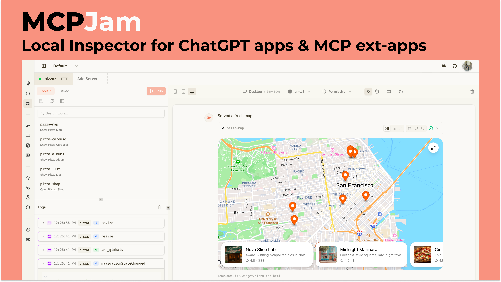
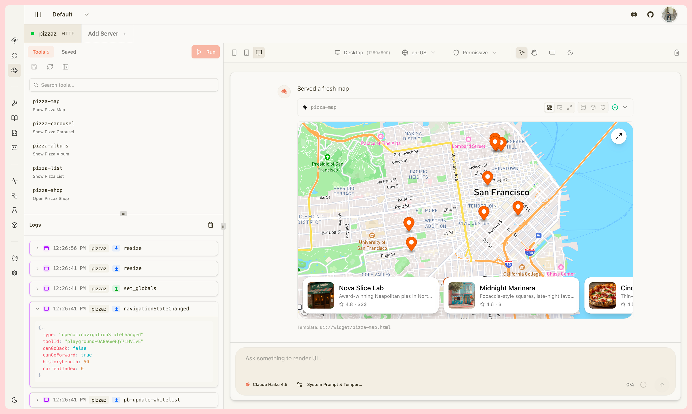
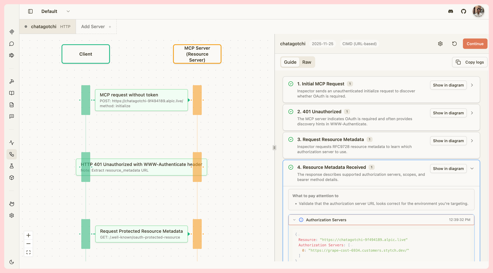
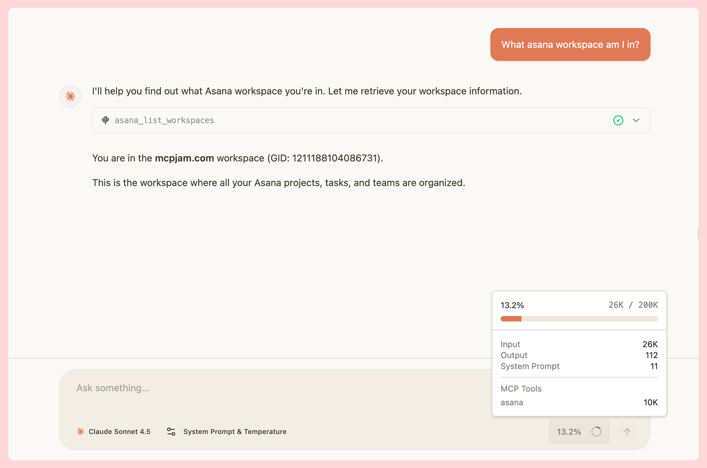
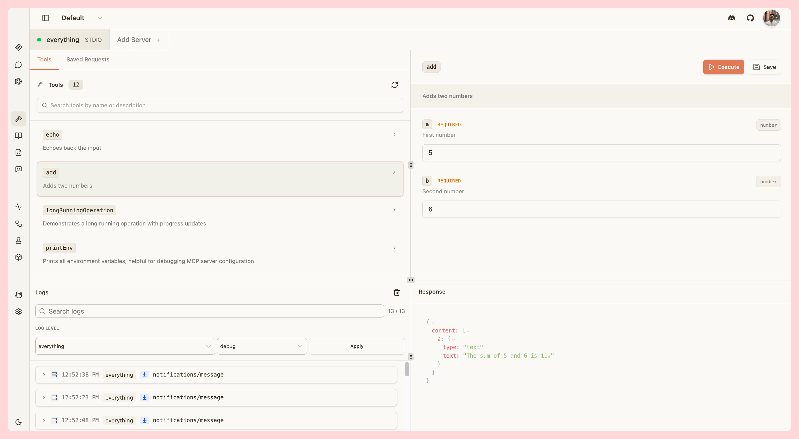

<div align="center">

<picture>
  <source media="(prefers-color-scheme: dark)" srcset="../mcpjam-inspector/client/public/mcp_jam_dark.png">
  <source media="(prefers-color-scheme: light)" srcset="../mcpjam-inspector/client/public/mcp_jam_light.png">
  
</picture>

<br/>

www.mcpjam.com

[](https://www.npmjs.com/package/@mcpjam/inspector)
[](https://opensource.org/licenses/Apache-2.0)
[](https://discord.gg/JEnDtz8X6z)

</div>

MCPJam Inspector is the local development client for ChatGPT apps, MCP ext-apps, and MCP servers. Build and test your apps with a full widget emulator, chat with any LLM, and inspect your server’s tools, resources, prompts, and OAuth flows.

No more ngrok or ChatGPT subscription needed. MCPJam is the fastest way to iterate on any MCP project.

### 🚀 Quick Start

Start up the MCPJam inspector:

```bash
npx @mcpjam/inspector@latest
```



# Table of contents

- [Installation Guides](#installation-guides)
- [Key Features](#key-features)
  - [ChatGPT / MCP Apps Builder](#openai-apps--mcp-ui)
  - [OAuth Debugger](#oauth-debugger)
  - [LLM Playground](#llm-playground)
- [Contributing](#contributing-)
- [Links](#links-)
- [Community](#community-)
- [Shoutouts](#shoutouts-)
- [License](#-license)

# Installation Guides

### Requirements

[](https://nodejs.org/)
[](https://www.typescriptlang.org/)

## Install MCPJam

We recommend starting MCPJam inspector via `npx`:

```bash
npx @mcpjam/inspector@latest
```

We have a Mac and Windows desktop app:

- [Install Mac](https://github.com/MCPJam/inspector/releases/latest/download/MCPJam.Inspector.dmg)
- [Install Windows](https://github.com/MCPJam/inspector/releases/latest/download/MCPJam-Inspector-Setup.exe)

Run MCPJam using Docker:

```bash
docker run -p 6274:6274 mcpjam/mcp-inspector
```

## Internal LLM Gateway (Optional)

To wire the Chat tab to your internal LLM gateway (no hosted login required),
set these environment variables before starting the inspector:

```bash
export LLM_SERVER_URL="https://your-llm-gateway/v1/chat/completions"
export LLM_MODELS="model-a,model-b,model-c"
export LLM_API_KEY="your-api-key"

# Optional OAuth (sample only)
export LLM_OAUTH_ENDPOINT="https://auth.example.com/oauth/token"
export LLM_CLIENT_ID="your-client-id"
export LLM_CLIENT_SECRET="your-client-secret"

# Optional tuning
export LLM_OAUTH_SCOPE="read"
export LLM_OAUTH_GRANT_TYPE="client_credentials"
export LLM_VERIFY_SSL="true"
```

Notes:
- `LLM_MODELS` is a comma-separated list shown in the Chat model selector.
- `LLM_SERVER_URL` can be `/v1` or `/v1/chat/completions` — both are supported.

## Internal Auth + Evals (Optional)

To run the Inspector in a corporate environment without WorkOS sign-in,
enable internal auth and provide a Convex service token. This allows the
Evals tab to work without the hosted signup flow.

```bash
# Required – enables internal auth on both server and client
export VITE_INTERNAL_AUTH="true"
export MCPJAM_INTERNAL_AUTH="true"

# Display identity shown in the UI
export MCPJAM_INTERNAL_USER_NAME="Internal User"
export MCPJAM_INTERNAL_USER_EMAIL="internal@example.com"

# Optional – only needed if you want the Evals tab (Convex-backed)
export CONVEX_URL="https://your-convex.cloud"
export CONVEX_HTTP_URL="https://your-convex.cloud"
export CONVEX_AUTH_TOKEN="your-convex-service-token"
```

Notes:
- Both `VITE_INTERNAL_AUTH` and `MCPJAM_INTERNAL_AUTH` must be set to `"true"`.
- Without Convex credentials the Evals tab will show a placeholder; all other
  tabs (Chat, Tools, Resources, OAuth) work normally.
- The Convex service token is passed to the browser in internal mode, so use
  this only in trusted environments.

## Docker / Kubernetes Deployment

Use Docker Compose for local testing, then deploy the same image to Kubernetes.

### Quick Start

```bash
cd MCPJam-Inspector

# Copy the env template and fill in your values
cp mcpjam-inspector/.env.docker mcpjam-inspector/.env

# Build and run
docker compose -f mcpjam-inspector/docker-compose.yml build
docker compose -f mcpjam-inspector/docker-compose.yml up
```

Open [http://localhost:6274](http://localhost:6274) — the Inspector loads with
internal auth enabled (no login prompt).

### Environment Variable Reference

| Variable | Stage | Required | Description |
|---|---|---|---|
| `VITE_INTERNAL_AUTH` | Build | Yes | Set `"true"` to bake internal auth into the client bundle |
| `VITE_DISABLE_POSTHOG_LOCAL` | Build | No | Set `"true"` to disable analytics (default in compose) |
| `VITE_LLM_BASE_URL` | Build | No | LLM base URL baked into client (optional) |
| `VITE_LLM_MODELS` | Build | No | Model list baked into client (optional) |
| `MCPJAM_INTERNAL_AUTH` | Runtime | Yes | Enables internal auth on the server |
| `MCPJAM_INTERNAL_USER_EMAIL` | Runtime | No | Display email shown in the UI |
| `MCPJAM_INTERNAL_USER_NAME` | Runtime | No | Display name shown in the UI |
| `LLM_SERVER_URL` | Runtime | No | OpenAI-compatible chat completions endpoint |
| `LLM_MODELS` | Runtime | No | Comma-separated model list for the Chat tab selector |
| `LLM_API_KEY` | Runtime | No | Bearer token for the LLM gateway |
| `LLM_OAUTH_ENDPOINT` | Runtime | No | OAuth token endpoint (if gateway requires OAuth) |
| `LLM_CLIENT_ID` | Runtime | No | OAuth client ID |
| `LLM_CLIENT_SECRET` | Runtime | No | OAuth client secret |
| `CONVEX_URL` | Runtime | No | Convex URL (only for Evals tab) |
| `CONVEX_AUTH_TOKEN` | Runtime | No | Convex service token (only for Evals tab) |

**Build-time** (`VITE_*`) variables are baked into the JavaScript bundle and
require a rebuild to change. **Runtime** variables are read by the server on
startup and can be changed by restarting the container.

### Kubernetes Deployment

The same Docker image works in Kubernetes. Mount configuration as a ConfigMap
and secrets as a Secret:

```yaml
# Pass build args at image build time (CI/CD pipeline)
docker build \
  --build-arg VITE_INTERNAL_AUTH=true \
  --build-arg VITE_DISABLE_POSTHOG_LOCAL=true \
  -f mcpjam-inspector/Dockerfile .

# In your K8s Deployment spec, set runtime env vars:
env:
  - name: MCPJAM_INTERNAL_AUTH
    value: "true"
  - name: LLM_SERVER_URL
    valueFrom:
      configMapKeyRef:
        name: mcpjam-config
        key: llm-server-url
  - name: LLM_API_KEY
    valueFrom:
      secretKeyRef:
        name: mcpjam-secrets
        key: llm-api-key
```

# Key features

| Capability            | Description                                                                                                                                                                                                                                                                                        |
| --------------------- | -------------------------------------------------------------------------------------------------------------------------------------------------------------------------------------------------------------------------------------------------------------------------------------------------- |
| ChatGPT Apps SDK      | Local development for ChatGPT Apps SDK support. Full support for the `windows.openai` API: `widgetState`, `callTool`, `structuredContent`, `sendFollowUpMessage`, `displayMode`, CSP, and more. No more ngrok or ChatGPT subscription needed. [Read more](https://www.mcpjam.com/blog/app-builder) |
| MCP ext-apps (Claude) | Full local development for MCP Apps (SEP-1865). Support for all JSON-RPC message types, such as `tools/call`, `ui/initialize`, `ui/message`, `ui/open-link`, and more. [Read more](https://www.mcpjam.com/blog/mcp-apps-preview)                                                                   |
| OAuth Debugger        | Debug your MCP server's OAuth implementation at every step. Visually inspect every network message. Supports all protocol versions (03-26, 06-18, and 11-25). Support for client pre-registration, DCR, and CIMD. [Read more](https://www.mcpjam.com/blog/oauth-debugger)                          |
| LLM playground        | Chat with your MCP server against any LLM in the playground. We provide frontier models such as GPT-5 and Claude Sonnet for free, or bring your own API key. Playground supports ChatGPT apps and MCP Apps. [Read more](https://www.mcpjam.com/blog/frontier-models)                               |
| MCP server debugging  | Connect to and test any MCP server local or remote. Manually invoke MCP tools, resources, resource templates, and elicitation flows. View all JSON-RPC logs. Support for all features from the official MCP inspector.                                                                             |
| Server info           | View server icons, version, capabilities, instructions, and ChatGPT widget metadata exposed by the server. [Read more](https://www.mcpjam.com/blog/server-instructions)                                                                                                                            |

## ChatGPT Apps / MCP Apps Builder

Develop [ChatGPT apps](https://developers.openai.com/apps-sdk/) and [MCP apps (Claude)](https://github.com/modelcontextprotocol/modelcontextprotocol/pull/1865) in MCPJam's Apps Builder. Apps Builder is a local emulator to quickly view and iterate on your widgets.

- Manually invoke a tool to instantly view the widget, or chat with your server using an LLM.
- View all JSON-RPC messages, `window.openai` messages in the logs.
- Change emulator device to Desktop, Tablet, or Mobile views.
- Test your app's locale change, CSP permissions, light / dark mode, hover & touch, and safe area insets.



## OAuth Debugger

View every step of the OAuth handshake in detail, with guided explanations. Test with every version of the OAuth spec (03-26, 06-18, and 11-25). Support for client pre-registration, Dynamic Client Registration (DCR), and Client ID Metadata Documents (CIMD).



## LLM Playground

Try your server against any LLM model. We provide frontier models like GPT-5, Claude Sonnet, Gemini 2.5 for free, or bring your own API key. View your server's token usage.



## MCP Inspector

MCPJam contains all of the tooling to test your MCP server. Test your server's tools, resources, prompts, templates, with full JSON-RPC observability. MCPJam has all features from the original inspector and more.



# Contributing 👨‍💻

We're grateful for you considering contributing to MCPJam. Please read our [contributing guide](CONTRIBUTING.md).

Join our [Discord community](https://discord.gg/JEnDtz8X6z) where the contributors hang out at.

# Links 🔗

- [Website](https://www.mcpjam.com/)
- [Blog](https://www.mcpjam.com/blog)
- [Pricing](https://www.mcpjam.com/pricing)
- [Docs](https://docs.mcpjam.com/)

# Community 🌍

- [Discord](https://discord.gg/JEnDtz8X6z)
- [𝕏 (Twitter)](https://x.com/mcpjams)
- [LinkedIn](https://www.linkedin.com/company/mcpjam)

# Shoutouts 📣

Some of our partners and favorite frameworks:

- [Stytch](https://stytch.com) - Our favorite MCP OAuth provider
- [xMCP](https://xmcp.dev/) - The Typescript MCP framework. Ship on Vercel instantly.
- [Alpic](https://alpic.ai/) - Host MCP servers. Try their new [Skybridge framework](https://github.com/alpic-ai/skybridge) for ChatGPT apps!

---

# License 📄

This project is licensed under the **Apache License 2.0** - see the [LICENSE](LICENSE).
