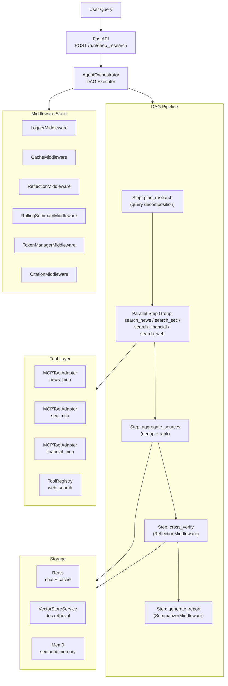

# Deep Research Agent

A production-ready, multi-source research agent built on the **AgentOrchestrator** framework.  It goes beyond simple Q&A by running an iterative, parallel research pipeline across news feeds, SEC/EDGAR filings, financial databases, and the web — then cross-verifying and synthesising findings into a comprehensive cited report.

> **Example query:** _"Show me all M&A deals greater than $1B that were announced or updated in the past two weeks."_

---

## Architecture



---

## How It Works

| Phase | Step | What happens |
|---|---|---|
| 1 | `plan_research` | LLM decomposes the query into 2–4 precise sub-queries with date range, deal-value filter, and source hints |
| 2 | `search_*` (×4, parallel) | Four ReActAgent instances run concurrently — each calls its MCP data source iteratively, refining the query if results are sparse |
| 3 | `aggregate_sources` | Findings are merged, de-duplicated by title/deal-ID, and sorted by date |
| 4 | `cross_verify` | LLM validates each finding against the user's criteria; conflicts are flagged, off-topic items removed |
| 5 | `generate_report` | LLM synthesises a fully cited Markdown (or JSON) report with an executive summary, categorised findings, and a coverage-notes appendix |

The **ReAct loop** (Thought → Action → Observation) inside each search step means the agent can self-correct: if a search returns zero results it will refine its query and retry, up to `REACT_MAX_ITERATIONS` times.

---

## File Structure

```
deep_research/
├── __init__.py          # Package entry point
├── config.py            # All settings from environment variables
├── tools.py             # Shared ToolRegistry (utility + stub search tools)
├── react_searcher.py    # ReActAgent factory — wraps MCP adapters per source
├── steps.py             # Five @ao.step functions with LLM prompt templates
├── chain.py             # Pipeline DSL — DAG wiring with deps and timeouts
├── middleware.py        # Middleware stack composition (7 layers)
├── server.py            # FastAPI app — endpoints, lifespan, SSE streaming
├── README.md            # This file
└── Dockerfile
```

---

## Quick Start (Local)

### 1. Install dependencies

```bash
pip install "agentorchestrator[mcp]" fastapi uvicorn
```

### 2. Configure environment

Copy `.env.example` and fill in your values:

```bash
cp agentorchestrator/.env.example deep_research/.env
```

Minimum required variables:

```ini
# LLM Gateway
LLM_SERVER_URL=https://your-llm-gateway/v1/chat/completions
LLM_API_KEY=sk-...                    # or use OAuth vars below
# LLM_OAUTH_ENDPOINT=https://...
# LLM_CLIENT_ID=...
# LLM_CLIENT_SECRET=...

# MCP Data Sources — fill these in your corporate environment
MCP_NEWS_ENDPOINT=https://news-mcp.internal/mcp
MCP_NEWS_SECRET=your-news-mcp-secret

MCP_SEC_ENDPOINT=https://sec-mcp.internal/mcp
MCP_SEC_SECRET=your-sec-mcp-secret

MCP_FINANCIAL_ENDPOINT=https://financial-mcp.internal/mcp
MCP_FINANCIAL_SECRET=your-financial-mcp-secret
```

> **Note:** MCP endpoints are stubs until you configure them.  The service still runs and returns LLM-generated placeholder results so you can test the full pipeline without live data sources.

### 3. Run the service

```bash
cd /path/to/repo
uvicorn deep_research.server:app --host 0.0.0.0 --port 8000 --reload
```

### 4. Submit a research query

```bash
curl -X POST http://localhost:8000/run/deep_research \
  -H "Content-Type: application/json" \
  -d '{
    "query": "Show me all M&A deals greater than $1B announced in the past 2 weeks",
    "system_instructions": [
      "Include deals from all regions",
      "Include all sources",
      "Include deal updates",
      "Exclude deals below $1B",
      "Exclude deals older than 2 weeks",
      "Prioritize sources equally"
    ]
  }'
```

**Response:**

```json
{
  "run_id": "3fa85f64-5717-4562-b3fc-2c963f66afa6",
  "status": "pending",
  "message": "Research run submitted. Poll GET /runs/3fa85f64-.../status for status."
}
```

### 5. Poll for completion

```bash
curl http://localhost:8000/runs/3fa85f64-5717-4562-b3fc-2c963f66afa6
```

```json
{
  "run_id": "3fa85f64-...",
  "status": "completed",
  "steps_completed": ["plan_research", "search_news", "search_sec", "search_financial", "search_web", "aggregate_sources", "cross_verify", "generate_report"]
}
```

### 6. Fetch the report

```bash
curl http://localhost:8000/runs/3fa85f64-5717-4562-b3fc-2c963f66afa6/output
```

```json
{
  "run_id": "3fa85f64-...",
  "status": "completed",
  "report": "# M&A Research Report\n\n## Executive Summary\n...",
  "stats": {
    "verified_findings": 23,
    "flagged_findings": 2,
    "source_counts": { "news": 8, "sec": 6, "financial": 7, "web": 4 }
  }
}
```

---

## How Streaming Works (`server.py`)

When a client calls `POST /run/deep_research/stream`, the server wires together three components using the framework's built-in `debug_callback` hook:

```
ao.launch(..., debug_callback=fn)
        │
        │  DAGExecutor calls fn(ctx, step_name, result_dict)
        │  synchronously after each step — safe to call put_nowait()
        ▼
asyncio.Queue  (one per run, keyed by run_id)
        │
        │  _sse_generator() reads from queue with 1s timeout
        │  (re-checks client disconnect on each tick)
        ▼
StreamingResponse(media_type="text/event-stream")
        │
        └─ yields  data: {...}\n\n  for each step
           yields  : keep-alive\n\n  every 1s while waiting (prevents proxy timeouts)
           yields  pipeline_completed / pipeline_failed  when sentinel None arrives
```

Key design decisions:

- **`debug_callback` is sync** — called from inside the async DAG executor loop, so `queue.put_nowait()` (non-blocking) is safe with no extra thread coordination needed.
- **1-second timeout on queue reads** — allows the generator to check `request.is_disconnected()` on every tick. If the client drops the connection, the generator exits and the queue is cleaned up.
- **`None` sentinel** — `_execute_run` puts `None` on the queue when the pipeline finishes (success or failure). The generator treats this as the stop signal and emits the final `pipeline_completed` or `pipeline_failed` event.
- **`X-Accel-Buffering: no` header** — disables nginx response buffering so events arrive in real time rather than batching behind a corporate proxy.
- **Both modes coexist** — `POST /run/deep_research` (poll-based, no queue) and `POST /run/deep_research/stream` (SSE, with queue) run the same underlying `_execute_run` coroutine. The only difference is whether a queue is registered before the task starts.

---

## API Reference

| Method | Path | Description |
|---|---|---|
| `POST` | `/run/deep_research` | Submit a research query — returns `run_id` immediately (poll-based) |
| `POST` | `/run/deep_research/stream` | Submit + stream real-time SSE progress (recommended) |
| `GET` | `/runs/{run_id}` | Poll run status |
| `GET` | `/runs/{run_id}/output` | Fetch final report + stats |
| `GET` | `/chains` | List registered chains |
| `GET` | `/health` | Full health (LLM + MCP adapters) |
| `GET` | `/ready` | Kubernetes readiness probe |
| `GET` | `/live` | Kubernetes liveness probe |

### Streaming endpoint (SSE)

`POST /run/deep_research/stream` returns `text/event-stream`. Each SSE message is a JSON object with an `event` field:

| `event` value | When | Extra fields |
|---|---|---|
| `run_started` | Pipeline begins | `run_id`, `query` |
| `step_completed` | After each DAG step | `step`, `label`, `success`, `duration_ms`, `error` |
| `pipeline_completed` | All steps done | `run_id`, `stats` |
| `pipeline_failed` | Any step threw | `run_id`, `error` |

```bash
# Stream with curl (-N disables buffering)
curl -N -X POST http://localhost:8000/run/deep_research/stream \
  -H "Content-Type: application/json" \
  -d '{
    "query": "Show me all M&A deals greater than $1B in the past 2 weeks",
    "system_instructions": ["Include deals from all regions", "Exclude deals below $1B"]
  }'
```

Example stream output:
```
data: {"event": "run_started", "run_id": "3fa8...", "query": "Show me all M&A deals..."}

data: {"event": "step_completed", "step": "plan_research", "label": "Planning research sub-queries…", "success": true, "duration_ms": 2341.0}

data: {"event": "step_completed", "step": "search_news", "label": "Searching news sources…", "success": true, "duration_ms": 8721.0}

data: {"event": "step_completed", "step": "search_sec", "label": "Searching SEC/EDGAR filings…", "success": true, "duration_ms": 9103.0}

data: {"event": "step_completed", "step": "aggregate_sources", "label": "Aggregating and deduplicating findings…", "success": true, "duration_ms": 1204.0}

data: {"event": "pipeline_completed", "run_id": "3fa8...", "stats": {"verified_findings": 23, "source_counts": {...}}}
```

> The `X-Run-Id` response header contains the `run_id` so you can also call `GET /runs/{run_id}/output` after the stream ends to retrieve the full report as JSON.

---

## Configuration Reference

All settings live in `config.py` and are read from environment variables.

| Variable | Default | Description |
|---|---|---|
| `LLM_SERVER_URL` | `http://localhost:8080/v1/...` | LLM gateway URL |
| `LLM_MODEL_NAME` | `gpt-4` | Model to use |
| `LLM_API_KEY` | — | API key (or use OAuth) |
| `MCP_NEWS_ENDPOINT` | — | News MCP server URL |
| `MCP_SEC_ENDPOINT` | — | SEC/EDGAR MCP server URL |
| `MCP_FINANCIAL_ENDPOINT` | — | Financial data MCP server URL |
| `MCP_*_ROUTING` | `path` | `path` (RavenPack-style) or `jsonrpc` (CapIQ-style) |
| `REDIS_HOST` | `localhost` | Redis host for caching |
| `CHAIN_MAX_PARALLEL_STEPS` | `4` | Max concurrent parallel search steps |
| `REACT_MAX_ITERATIONS` | `5` | Max ReAct loop iterations per source |
| `PLANNER_MAX_SUB_QUERIES` | `4` | Max sub-queries from planner |
| `RESULTS_PER_SOURCE` | `20` | Max findings kept per source before aggregation |
| `SUMMARIZER_STRATEGY` | `map_reduce` | `map_reduce` \| `stuff` \| `refine` |
| `REPORT_FORMAT` | `markdown` | `markdown` \| `json` |
| `AO_ENABLE_TRACING` | `false` | Enable OpenTelemetry tracing |
| `LOG_LEVEL` | `INFO` | Python log level |
| `PORT` | `8000` | Server port |

---

## Registering with Cohere North (MCP)

The service exposes itself as an MCP server at `POST /mcp/tools/call`. Any MCP-compatible UI — Cohere North, Claude, or your own frontend — can call it as a tool.

### 1. Set the shared secret

In your `.env` (or Kubernetes Secret), set a shared secret Cohere will use to authenticate:

```ini
MCP_SERVER_SECRET=your-shared-secret-here
```

### 2. Register in Cohere North

In Cohere North's MCP connection settings, add a new server:

| Field | Value |
|---|---|
| **Endpoint** | `https://deep-research-agent.internal/mcp` |
| **Auth type** | Bearer token |
| **Secret** | The value of `MCP_SERVER_SECRET` |

Cohere North will call `POST /mcp/tools/list` at startup and discover the `deep_research` tool automatically.

### 3. What Cohere North sees

```json
{
  "name": "deep_research",
  "description": "Iterative multi-source financial research agent. Searches news, SEC/EDGAR filings, and financial databases via internal MCP servers...",
  "inputSchema": {
    "type": "object",
    "properties": {
      "query": { "type": "string" },
      "system_instructions": { "type": "array", "items": { "type": "string" } }
    },
    "required": ["query"]
  }
}
```

### 4. How a call flows

When a user asks a research question in Cohere North, the LLM decides to call the `deep_research` tool and sends `POST /mcp/tools/call`. The service responds with a streaming SSE response:

```
data: {"type": "progress", "step": "plan_research",    "label": "Planning research sub-queries…",   "duration_ms": 2100}
data: {"type": "progress", "step": "search_news",      "label": "Searching news sources…",          "duration_ms": 8700}
data: {"type": "progress", "step": "search_sec",       "label": "Searching SEC/EDGAR filings…",     "duration_ms": 9100}
data: {"type": "progress", "step": "aggregate_sources","label": "Aggregating findings…",            "duration_ms": 1200}
data: {"type": "progress", "step": "cross_verify",     "label": "Cross-verifying findings…",        "duration_ms": 11400}
data: {"type": "progress", "step": "generate_report",  "label": "Generating final report…",         "duration_ms": 18300}
data: {"type": "result",   "content": "# M&A Research Report\n\n## Executive Summary\n…", "stats": {...}}
```

Cohere North receives the full report as the tool result and incorporates it into its response to the user.

### MCP endpoints summary

| Method | Path | Description |
|---|---|---|
| `POST` | `/mcp/initialize` | MCP handshake — returns server capabilities |
| `POST` | `/mcp/tools/list` | Returns the `deep_research` tool schema |
| `POST` | `/mcp/tools/call` | Runs the pipeline, streams SSE progress + final report |

### Adding more MCP tools from the same service

Use `@mcp.tool()` for simple one-off tools (no pipeline needed):

```python
from agentorchestrator.server.mcp import MCPServer

@_mcp_server.tool(
    name="get_research_status",
    description="Check whether a previous research run is complete.",
    input_schema={"run_id": {"type": "string"}},
)
async def get_research_status(run_id: str) -> str:
    run = _runs.get(run_id)
    return run["status"] if run else "not found"
```

---

## Kubernetes Deployment

Kubernetes manifests (Deployment, Service, ConfigMap, Secret) are not included here — add them once you move the service into your corporate environment. The service exposes:

- Port `8000` (configurable via `PORT` env var)
- `GET /ready` — readiness probe
- `GET /live` — liveness probe
- `GET /health` — full health check including MCP adapter status

---

## Extending the Agent

**Add a new data source:**
1. Set `MCP_MYDATA_ENDPOINT` + `MCP_MYDATA_SECRET` in your env.
2. Add a `search_mydata` step in `steps.py` (copy `search_news` as a template).
3. Add `.step("search_mydata", fn=search_mydata, deps=["plan_research"])` in `chain.py`.
4. Add `"mydata"` to the `deps` list of `aggregate_sources`.

**Switch to a different LLM:**
Update `LLM_SERVER_URL` and `LLM_MODEL_NAME` — the rest of the pipeline is model-agnostic.

**Persist runs across restarts:**
Set `CONTEXT_STORE_BACKEND=redis` and `REDIS_HOST=your-redis` to use the Redis-backed run store instead of the default in-memory store.
