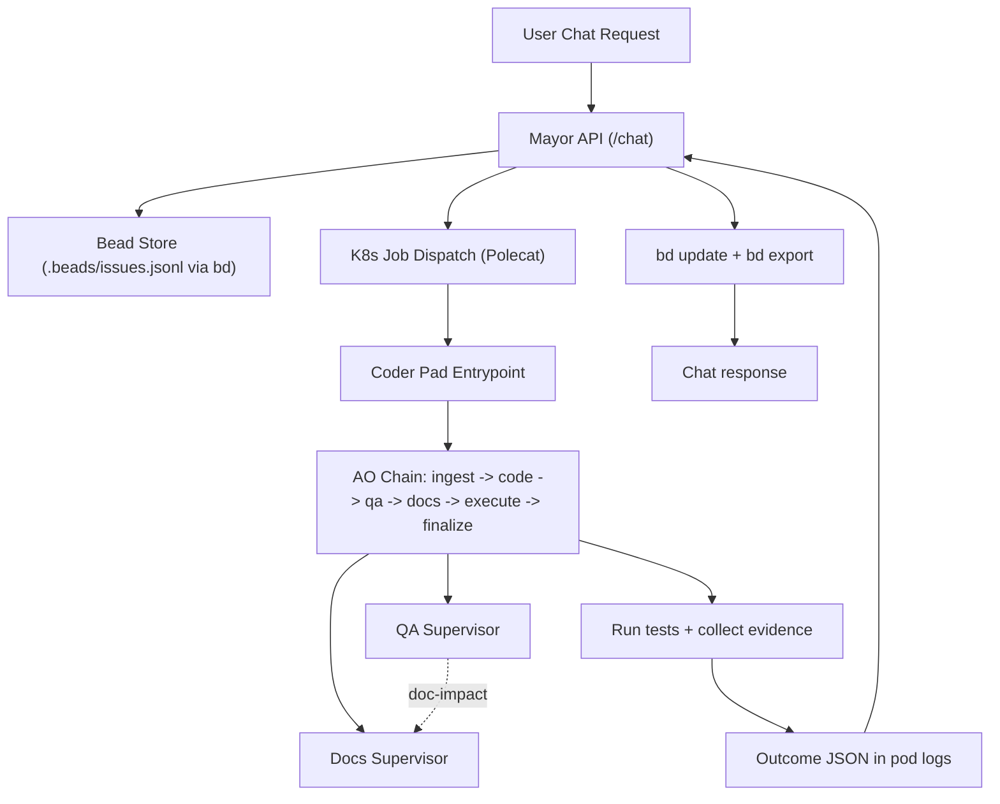

# Coder Pad MVP: Issue -> Code -> QA -> Docs

Full start-to-end walkthrough:
- `docs/coder_pad_end_to_end.md`

## User-Facing Story

Users interact with a Mayor-style `/chat` API.
The API resolves a bead from `.beads/issues.jsonl` (via `bd`), dispatches a Polecat job
to Kubernetes, waits for completion, then updates the bead status and notes.

## Pipeline



## Seed Example Beads

```bash
./examples/coder_pad_mvp/seed_beads.sh
```

## Run Mayor API Locally (dispatches to Kubernetes)

```bash
make coderpad-image-build
make coderpad-kind-load
make coderpad-mayor-run
```

Then create a bead + dispatch from chat:

```bash
curl -sS -X POST http://127.0.0.1:8787/beads \
  -H 'content-type: application/json' \
  -d '{
    "title": "Build calculator with docs",
    "description": "Create calculator app with CLI, tests, and docs",
    "issue_type": "task",
    "priority": 1,
    "labels": ["coder-pad","calculator"]
  }'

curl -sS -X POST http://127.0.0.1:8787/chat \
  -H 'content-type: application/json' \
  -d '{
    "bead_id": "REPLACE_WITH_BEAD_ID",
    "message": "Fix this bead",
    "wait_for_completion": true
  }'
```

## Runtime Contract (Polecat)

- Bead-only input:
  - `GASTOWN_BEAD_JSON` (preferred)
  - `GASTOWN_BEAD_ID` (fallback, requires `bd` in container)
- `WORKTREE_PATH` (default `/workspace`)
- `GASTOWN_OUTPUT_DIR` (default `/workspace/.gastown`)
- `POLECAT_TEST_CMD`
- `POLECAT_AUTOCOMMIT`

`GASTOWN_TASK_JSON` is no longer used for Coder Pad runtime.
