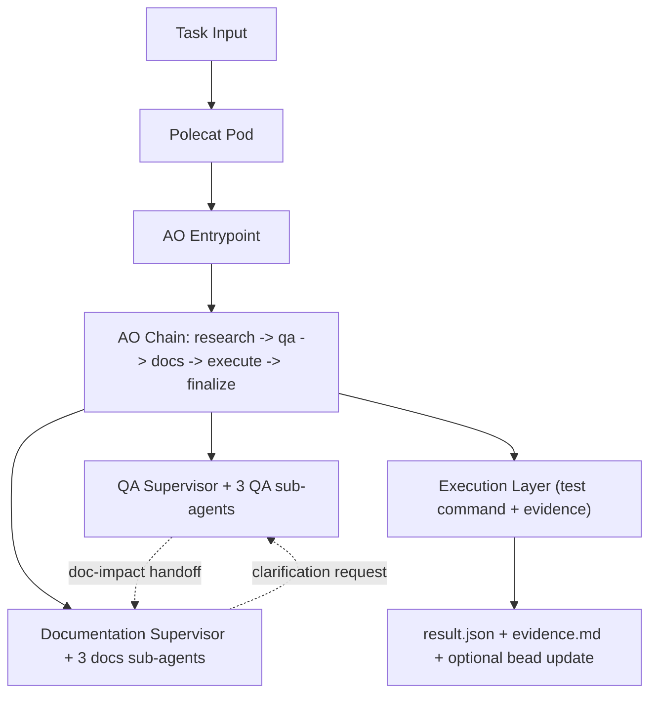

# Gastown MVP: Polecat Autonomous QA + Docs Flow

## What This MVP Proves

This MVP runs one Polecat-compatible pod that executes:

1. `ingest_task`
2. `deep_research_context`
3. `run_qa_supervisor`
4. `run_docs_supervisor`
5. `execute_changes_and_tests`
6. `finalize_and_publish`

The runtime is implemented in:

- `examples/gastown_mvp/` (suite logic and contracts)
- `agentorchestrator/integrations/gastown_mvp/entrypoint.py` (pod entrypoint)

Artifacts are written to:

- `result.json`
- `evidence.md`

Default output path: `/workspace/.gastown`.

## MVP Architecture



## Runtime Contract

Supported env vars:

- `GASTOWN_TASK_JSON` (preferred task input)
- `GASTOWN_BEAD_ID` (fallback task source)
- `WORKTREE_PATH` (default `/workspace`)
- `DEEP_RESEARCH_BASE_URL` (optional external deep research service)
- `POLECAT_TEST_CMD` (default `pytest -q`)
- `POLECAT_AUTOCOMMIT` (default `false`)
- `GASTOWN_OUTPUT_DIR` (default `/workspace/.gastown`)

Behavior:

- If deep research backend is unavailable, chain falls back to heuristic context.
- If `bd` is unavailable, runtime still succeeds and writes local artifacts.

## Run Locally

```bash
export WORKTREE_PATH="$(pwd)"
export GASTOWN_TASK_JSON='{"task_id":"mvp-1","description":"Run QA and docs flow"}'
python -m agentorchestrator.integrations.gastown_mvp.entrypoint
```

## Run on kind

```bash
make mvp-kind-create
make mvp-image-build
make mvp-kind-load
make mvp-deploy
make mvp-logs
```

Manifest: `k8s/mvp/polecat-mvp.yaml`.

## Upgrade to Real Gastown Operator (Next Phase)

Keep this same env contract and chain API. Upgrade only deployment/runtime wiring:

1. Replace direct pod creation with operator-managed `PolecatRun` resources.
2. Replace in-process delegate implementation with remote proxy (`RemoteAgentProxy`/MCP).
3. Keep `examples/gastown_mvp` suite prompts and contracts unchanged.
4. Keep output artifacts (`result.json`, `evidence.md`) and bead update behavior unchanged.

This preserves MVP logic while moving scheduling, scaling, and cross-pod delegation into operator infrastructure.

