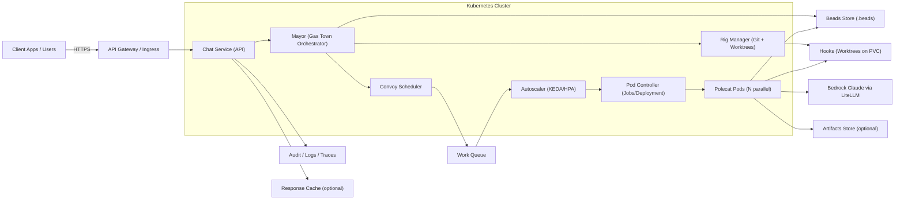
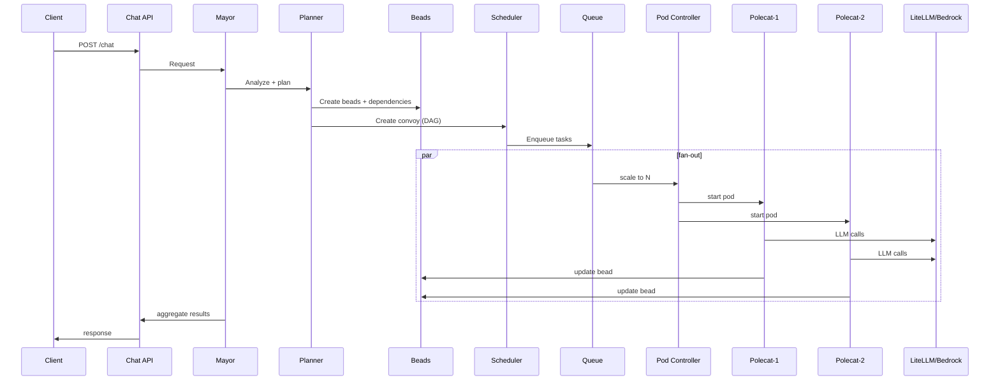
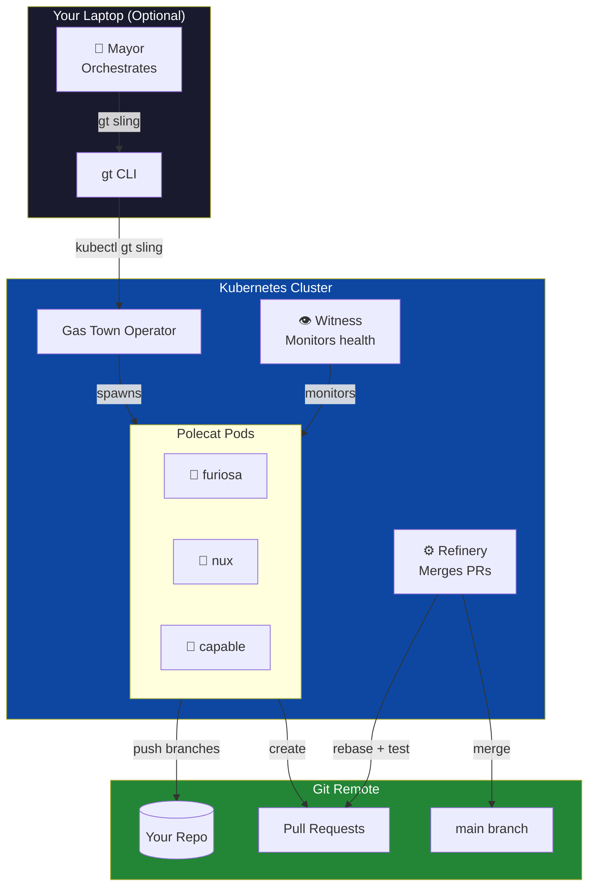

Links: 
1. https://github.com/steveyegge/gastown
2. https://github.com/boshu2/gastown-operator 

---------------------
A service receives a request, the Mayor plans via MEOW, tasks are turned into Beads/Convoys, and Polecat pods execute in parallel against a Git repo.
---------------------

**Problem Statement**

A controlled, auditable way to ask “fix this issue” against a Git repo and have autonomous agent pods execute changes, update Beads, and produce a PR or response without manual intervention.

**Goals**

- Provide a single service endpoint to accept repo + request.
- Use Gas Town (Mayor + Convoy + Polecats) to plan and execute tasks.
- Read and update issues via Beads (and optionally GitHub Issues).
- Run code execution safely in Kubernetes with auditability and controls.
- Return results to the user and/or open PRs.

**Non‑Goals**

- Full IDE experience in the browser.
- Support for all Git hosting providers on day one.
- Human‑level design reviews or manual testing decisions.

**User Workflow**

---------------------

1. User creates or updates issues in Beads for a target Git repo.
2. User calls the chat service with the repo URL and a request (e.g., “fix issue X”).
3. The service loads the repo and reads Beads to understand open tasks and dependencies.
4. The Mayor plans the work and builds a Convoy (task graph = decompose complex issues into parallelizable units of work) from Beads.
5. The Rig Manager prepares Hooks (git worktrees) on PVCs for each task.
6. The Convoy Scheduler dispatches tasks to the queue.
7. Autoscaling spins up the required number of Polecat pods in parallel.
8. Polecats execute tasks in isolated pods, call Bedrock via LiteLLM, and update Beads.
9. The Mayor aggregates results and returns a response to the user.
10. Optional artifacts (patches/logs) are stored and audit logs captured.

**Functional Requirements**

- Accept `repo_url` + `request` via API.
- Load repo and read Beads task state.
- Plan tasks using Mayor (MEOW workflow).
- Spawn multiple Polecat pods when tasks are parallelizable.
- Execute code changes via Claude Agent SDK in pods.
- Update Beads (and optionally GitHub) with results.
- Return summary, patch, and/or PR link.

**Non‑Functional Requirements**

- Security: sandboxed pods, restricted egress, non‑root, timeouts.
- Reliability: retries and failure states recorded in Beads.
- Scalability: autoscale worker pods based on queue depth.
- Auditability: full trace from request → bead → pod → git changes.
- Cost control: limits on max pods, max tokens, and execution time.

**System Assumptions & Dependencies**

- Kubernetes cluster available with autoscaling.
- LiteLLM configured to Bedrock Claude.
- GitHub App for baseline access.
- PAT currently required for repo write access (temporary).
- Beads storage accessible via git repo or shared PVC.

**Interfaces**

- API: `POST /chat` (sync or async TBD).
- Optional: webhook or polling endpoint for async completion.

**Risks / Open Questions**

- Decide if GitHub Issues or Beads is the system of record.
     - If GitHub Issues is primary, you need a sync layer to mirror issues into Beads and update GitHub on completion.
- where does tokens live, how they’re injected - will need to see how Devin is doing this. 
- Multiple Polecats can modify the same files.
     - We need repo‑level or file‑level locks, or a “one branch per task” policy with merge conflict handling.
- Claude agent SDK can run bash commands.
     - We must restrict pod privileges, egress, filesystem access, and enforce timeouts.
- Decide whether /chat is blocking or returns a job ID.
     - This affects queueing, retries, and user expectations.
- Decide if results are posted back to GitHub as PRs, issue comments or returned only in the chat responses ? 
- Max Pod per reo, max token per task and circuit breakers. 

**Success Criteria**

- 90%+ of requests complete with a valid patch or PR.
- All code execution is isolated and audited.
- Pod scaling responds to demand without runaway costs.
- No secrets exposed in logs or artifacts.

Notes: 

- Planning is effectively part of the Mayor in GT. Which is going to be our primary AI coordinator and the MEOW workflow explicitly helps Mayor analyze/ breaks down tasks, creates the convoy and spawns agents which is the "PLANNER" role.
- ~~Repo access needs scoped credentials (SSH key or token) per request - will need to check if this is possible~~
- Repo access: GitHub App is used for baseline access; a PAT is currently required for write operations (temporary). But can migrate to migrate write access fully to the App if possible.
     -  ** secrets never land in logs. **
- Each Polecat runs in a sandboxed pod (resource limits, non‑root, restricted egress).
- Concurrency limits apply per repo/tenant to prevent runaway scaling.
- Requests can be sync (wait for result) or async (job ID + polling/webhook).
- Failures update Beads state with retries/timeouts; partial results are still returned.
- Full observability: request IDs link API → Beads → pods → logs.
- Cost controls: max pods, max tokens, and circuit breakers.
- Artifact policy defines what is persisted (patches/logs) and retention length. 

-- 
Deployment 
-- 

1. This operator runs polecats as Kubernetes pods.
2. Can have the local gt CLI you already point to the operator service. The operator just gives you more compute - as much as your cluster can handle.
3. The unlock: Queue 50 issues. Dispatch 50 polecats. Close your laptop. Come back to PRs.

---------------------
**Why do we have to build it ourselves ?**
---------------------

- Vibe coding a prototype from scratch is fundamentally different from contributing code to RBC's codebase. 
- RBC's codebase encompasses hundereds of millions of lines of code across few large repositories. 
Throughout our code uses a vast number of homegrown libraries that are unique to Stripe and therefore natively unfamiliar to LLMs. 
- The stakes are high: this code should move well move $$$ payment volume live in production. 
RBC has many real-world dependencies on financial institutions and regulatory and compliance obligations that our code must honor. 
- LLM agents are incredibly good at building software from scratch when there are relatively few constraints on a system. However, iterating on any codebase of the scale, complexity and maturity of RBC's inherently much harder. Humans must build sophisticated mental models to make effective changes in our repo's and enabling agents to develop the correct intuitions and use the correct tools within the confines of their context windows is challenging. 
- 

---------------------
**What is Agent Swarm ?**
---------------------
An Agent Swarm is a multi-agent system where multiple specialized AI agents collaborate toward a shared goal, rather than one "Super Agent" trying to do everything. Think of it like a team of specialists (researcher, coder, reviewer, architech) passing work btwn each other rather than one exhausted generalist handling all tasks. 
* Multi-agent 
* Specialized roles
* HandOffs
* Persistent Work - Git-backed hooks survive restarts
* Coordination

| Component | What it Does |
|---------|--------------|
| **Agents** | Specialized workers with specific tools and prompts |
| **Handoffs** | Explicit transfers of control between Agents |
| **Context/ State** | Shared messages passed btwn Agents (Stateless design) |
| **Orchestration** | Either decentralized (Swarm) or with a light controller |

* Decentralized: No boss - agents coordinate thru local communication (like drone Swarms)
* Hierarchical: Central controller routes tasks to specalists
* Hybrid: Hierarchical control inside each agent, swarm coordination btwn them. 

| Use Case | Sandbox Purpose |
|---------|--------------|
| **Code Execution** | Run generated code safely without harming your system |
| **Training/ Testing** | Simulate environments to train multi-agent RL systems |
| **Safety** | Isolate agent actions (especially for web browsing, file system access) |
| **Reproducibility** | Controlled environments for debugging and benchmarking |

Simple swarms (like OpenAI Swarm) run as a pure Python code without a Sandbox. Complex or Physical Swarms typically use Sandboxes or simulators to test behaviors safely before real-world deployments. 

Modern Swarm frameworks (like OpenAI Swarm) prioritize simplicity and obervability over complexity: 
* Stateless: No hidden memory btwn calls- easier to debug. 
* Explicit handoffs: Clear who is in control at any moment. 
* No central "brain": Intelligence emerges from coordination, not a master controller. 
* Microservices approach: Each agent is a focused specialist. 

This makes swarms highly scalable fault-tolerant-if one agent fails, others continue. 
However, debugging emergent behaviors can be tricky since complex patterns arise from simple local rules interacting.